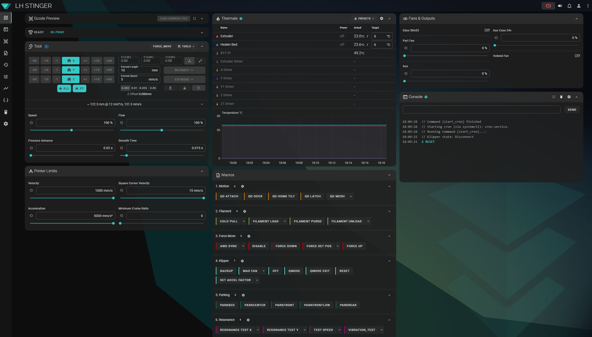

  [:arrow_double_down: Download Folder](https://download-directory.github.io/?url=https%3A%2F%2Fgithub.com%2Flhndo%2FLH-Stinger%2Ftree%2Fmain%2FConfig%2FFluidd_Theme)

# LH Stinger Fluidd Theme

   
## Installation

1. Place these files inside a `.fluidd-theme` folder located in your main `/config/` folder.  
2. Open **Settings**, nagivate to '**Fluidd settings in Moonraker database**'  
3. Choose `Restore`and load the `backup-fluidd.json` file provided here.
4. Refresh the website

 

### Credits

 *Built on the custom.css from [Fluid theme simple](https://github.com/bumbeng/Fluidd_theme_simple) by [bumbeng ](https://github.com/bumbeng)*