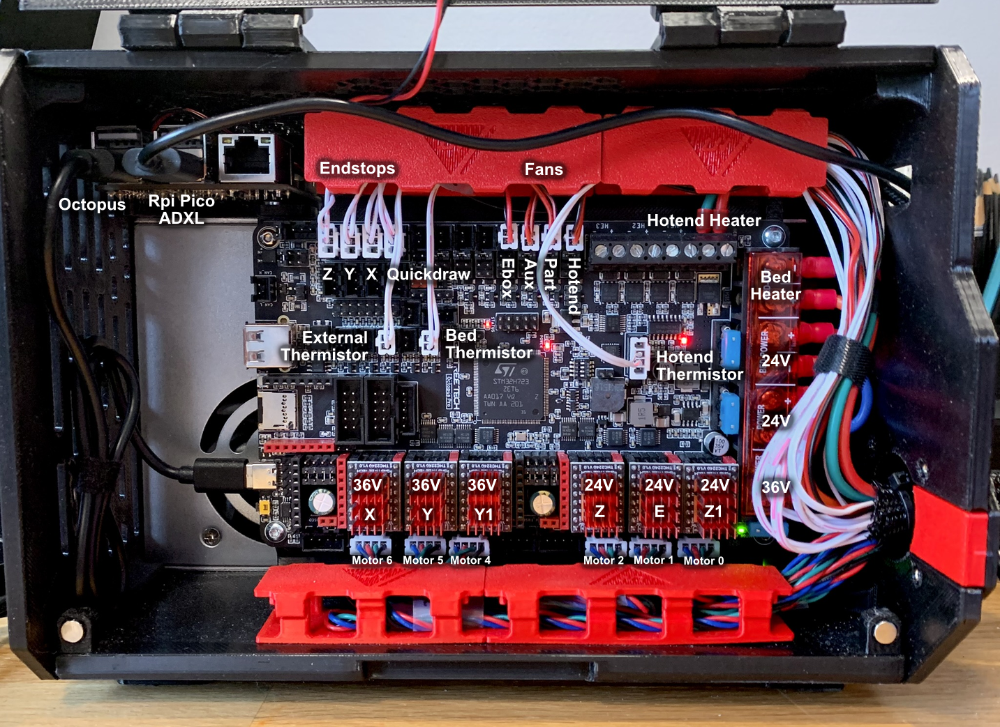
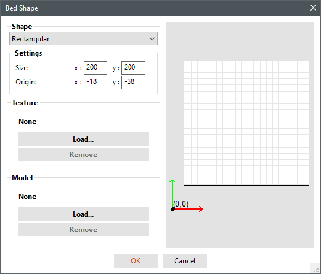

### *This Klipper configuration is set up for the following wiring setup*
Using the parts listed in the [BOM]( https://docs.google.com/spreadsheets/u/2/d/1s8ulLfThmbuy1G_40MvkXXL2oVx9PZhvpAY9hMxqYbg/edit?usp=drive_link)   

  

## Contents:
<!--ts-->

- [Prerequisites](#prerequisites)
    - [BTT PI 1.2](#btt-pi-12)
    - [KIAUH](#kiauh)
    - [Octopus PRO Firmware](#octopus-pro-firmware)
    - [xz\_dockable\_probe](#xz_dockable_probe)
    - [ResHelper](#reshelper)
    - [KAMP](#kamp)
- [Klipper Configuration](#klipper-configuration)
- [Moonraker Power Relay](#moonraker-power-relay)
- [Bed Origin](#bed-origin)
- [Slicer Start Gcode](#slicer-start-gcode)
  - [Orca Slicer](#orca-slicer)
  - [Prusa Slicer](#prusa-slicer)
<!--te-->
 

# Prerequisites

It is recommended to follow the installation in the order listed below

### BTT PI 1.2
Download the OS image: https://github.com/bigtreetech/CB1/releases (Same as CB1)  
Use [Balena Etcher](https://etcher.balena.io/) to burn the image onto the PI SD Card.  

### KIAUH
KIAUH is a rich featured script that makes it extremely easy to perform any Klipper related software installation, setup and firmware flashing starting from a bare OS. 
This should be the first thing to install after finishing your OS installation. 

https://github.com/dw-0/kiauh/tree/master  
From Kiauh install **Klipper** and **Moonraker**

### Octopus PRO Firmware
Follow the steps starting from "Build your own firmware" and make sure to choose the appropriate settings for your own MCU type. 
https://github.com/bigtreetech/BIGTREETECH-OCTOPUS-V1.0/tree/master/Firmware/Klipper#build-firmware-image  
 
The firmware setup process can also be easily done directly from KIAUH.  

### xz_dockable_probe

Download xz dockable probe module to: **~/klipper/klippy/extras/** as **xz_dockable_probe.py** by running the following commands:

<pre><code>cd ~/klipper/klippy/extras/
wget https://raw.githubusercontent.com/churls5495/Annex-Engineering_User_Mods/main/Extruders/Sherpa_Mini/Toolheads/Churls-Stiffy_E3/xz_dockable_probe.py
cd ../..
echo "klippy/extras/xz_dockable_probe.py" >> .git/info/exclude
systemctl restart klipper
</code></pre>

by [Dalegaard](https://github.com/dalegaard) and [Churls](https://github.com/churls5495/Annex-Engineering_User_Mods/tree/main/Extruders/Sherpa_Mini/Toolheads/Churls-Stiffy_E3)

### ResHelper

ResHelper is a script that simplifies and streamlines the resonance testing process. 
Follow the installation steps from the following link:  

https://github.com/lhndo/ResHelper

### KAMP
KAMP is a Klipper addon that provides adaptive bed meshing, which probes only the area occupied by the printed objects.

https://github.com/kyleisah/Klipper-Adaptive-Meshing-Purging/tree/main

 

# Klipper Configuration

* Copy the files from this folder to: **/home/biqu/printer_data/config**

* Open printer.cfg and comment/uncomment the lines in the header according to the instructions if needed. 
 
 

For more information please consult:  
[Ebox Guide](https://github.com/lhndo/LH-Stinger/wiki/Ebox)  
[Klipper Configuration Reference](https://www.klipper3d.org/Config_Reference.html)

For support please join the [LH Stinger Discord](https://discord.gg/EzssCfnEDS), or the [Klipper Discord](https://discord.klipper3d.org/)

 

# Moonraker Power Relay
If using a Power Relay to control the AC supply to the Ebox, then add the following section to your **moonraker.conf** .  
Note: The PI should be on its own independent power supply. 

<pre><code>[power Printer]
type: gpio
pin: gpiochip0/gpio262
off_when_shutdown: True
initial_state: off
restart_klipper_when_powered: True
</code></pre>

For more information on the **BTT Pi GPIO** pinout please consult this table: https://github.com/bigtreetech/CB1#40-pin-gpio

# Bed Origin

The printer supports multiple bed sizes. For ease of use, the bed position is defined in the slicer by changing the Origin Offsets, and not in Klipper's printer.cfg. 

Move the nozzle manually to the front left corner of the bed, and note the position, eg. X18 Y38.  
Add those values in the Origin section as negative values. 

 

# Slicer Start Gcode

## Orca Slicer

If not using the provided LH Stinger profiles, then in Printer > Machine G-Code set:  

Machine Start G-Code:  

`
PRINT_START_LHS BED=[bed_temperature_initial_layer_single] HOTEND=[nozzle_temperature_initial_layer] AUTOMESH=1 AUTOPURGE=1 QUIETMODE=0
`

Machine End G-Code: 

`PRINT_END`  

 

## Prusa Slicer

In Printer Settings > Custom G-Code set:  

Start G-Code:  

`
PRINT_START_LHS BED=[first_layer_bed_temperature] HOTEND=[first_layer_temperature[initial_extruder]] AUTOMESH=1 AUTOPURGE=1 QUIETMODE=0
`

End G-Code: 

`PRINT_END`
