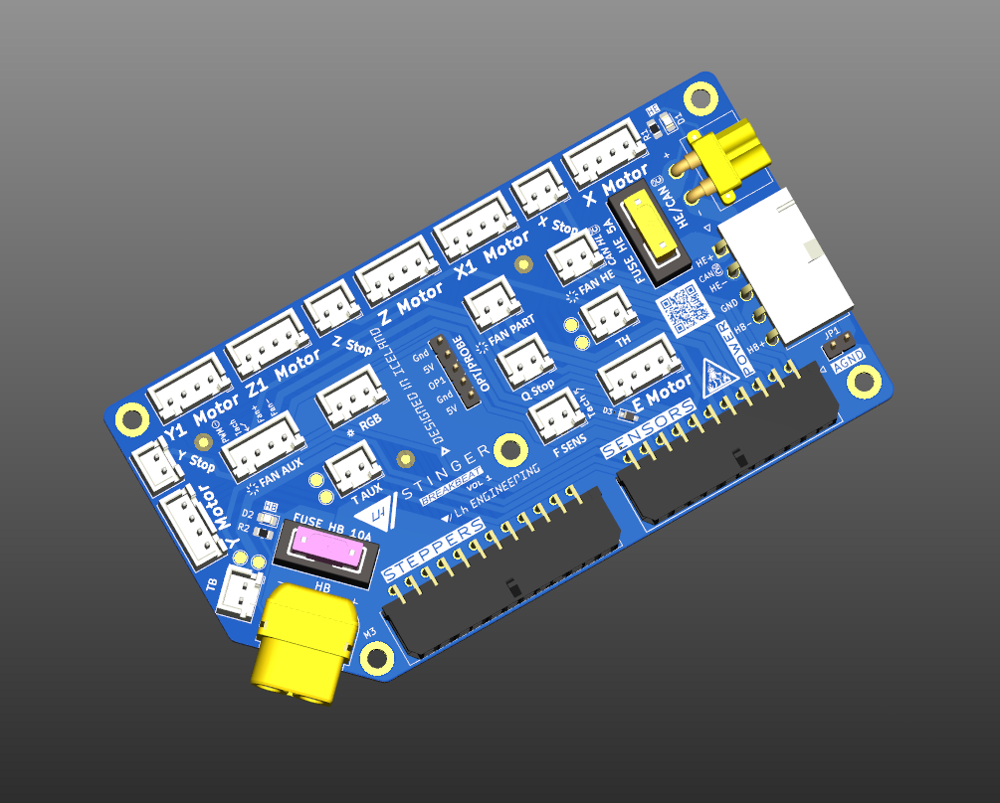

# LHS Breakbeat

**LHS Breakbeat** is a breakout board built for the LH Stinger, meant to provide an easy interface between the external electronics box and the printer electronics.

This board is meant to be mounted on the printer, and make most of the wiring setup plug and play.

## Features
* Support for 7 stepper motors
* 3 Thermistors
* 3 Fans with individual power requirements
  * 4-pin fan support
* 4 Endstops
* RGB lighting
* Optional probe header
* Filament Sensor (Tach and F Sens pins are shared)
* Fused bed and hotend power lines 
* Support for separate thermistor analog ground
* CAN bus alternative wiring
* Thermistor test points
* Tachometer diode protection

 

## BOM
Please see the [Interactive BOM](/BOM/ibom.html)
