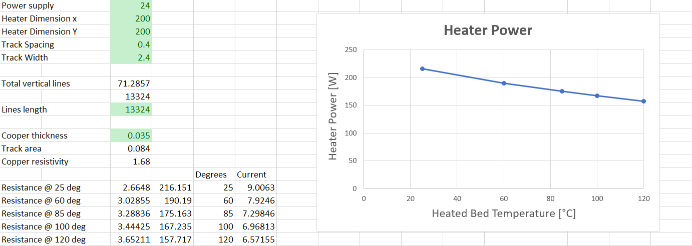
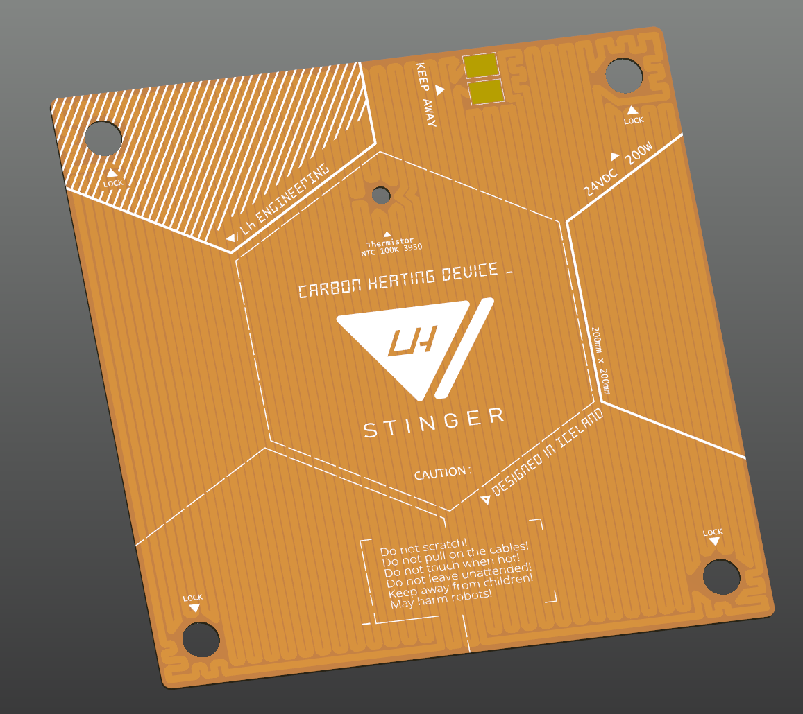
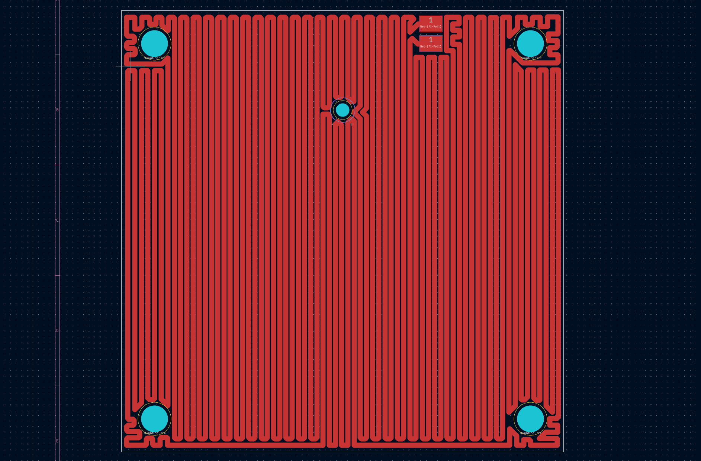
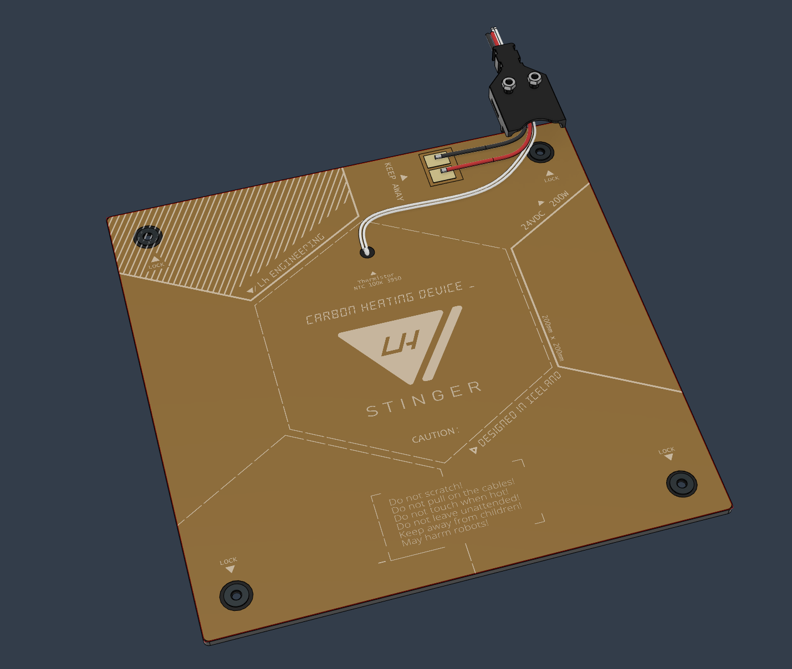
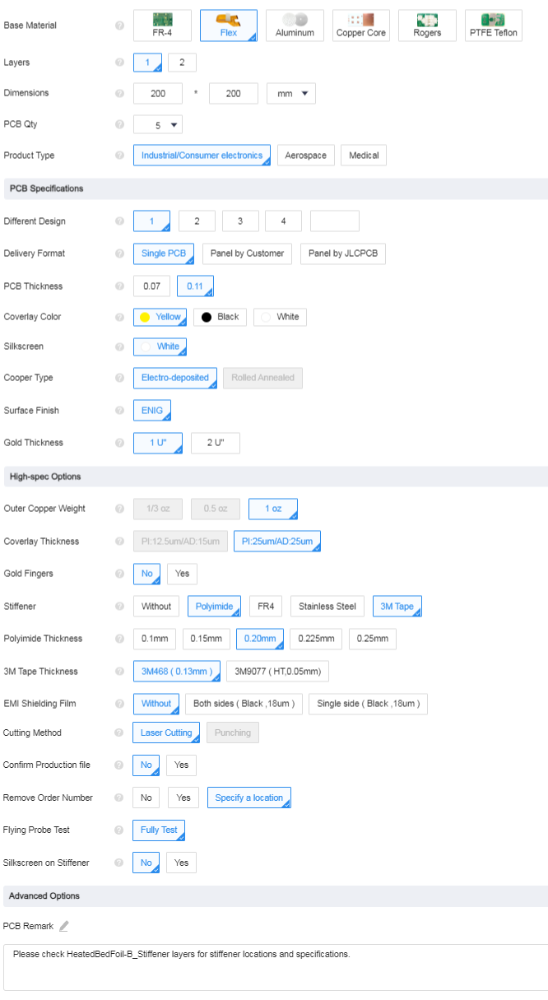

**NOTE: This design hasn't been tested yet.**  
   

**PCB**

- Flex Polyimide Base - as lightweight as possible
- Copper Thickness: 1oz (35 µm)
- 3M468MP or 3M9077 (to be tested) backside adhesive
- Silkscreen: White

 

**Power** 

- Voltage:  24V DC
- Resistance: 2.66 Ohm @ 25C (Please see the included Excel screenshot for calculations)
- Power: 216W @ 25C

 
**Thermistor** 
- NTC 100K 3950
   

**Power Cable**

 - 16 AWG Multi-strand Soft Electrical Silicone Cable
 - No connector, tinned wires
 - Length: 70cm

 
**Thermistor Cable**

- Preferred thin PTFE Wire around ~26 AWG
- 2 pin JST XH 2.54 female connector  

>Designed with the help of [Róbert Lőrincz](https://www.orbiterprojects.com/)  
>[Story Of The Orbitron Heated Bed Design](https://www.orbiterprojects.com/stories/story-of-the-orbitron-heated-bed-design/) 

   

**JLCPCB**

- Upload HeatedBedFoil_FS_GBR.zip and set the following specifications

