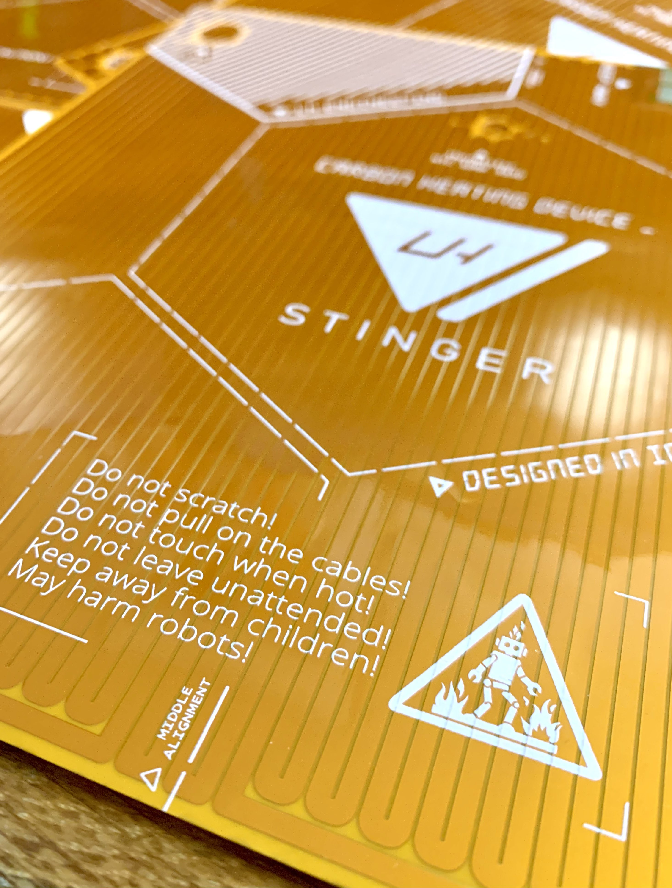
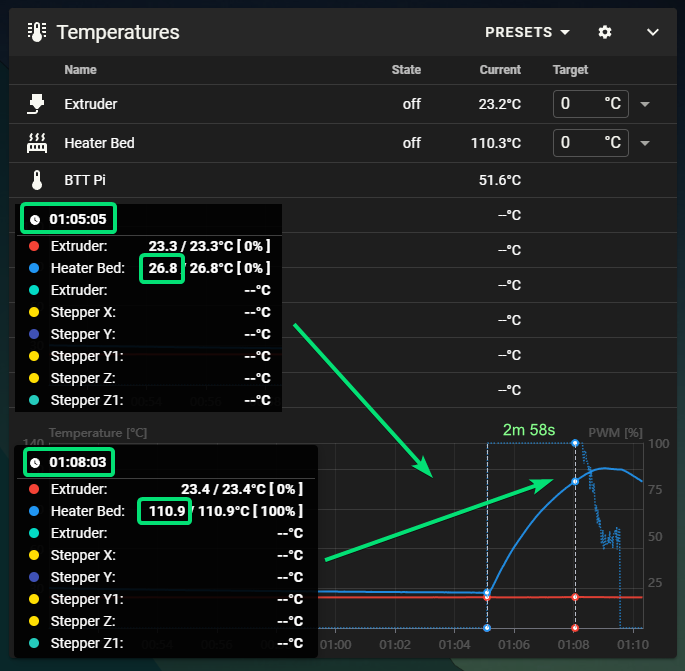
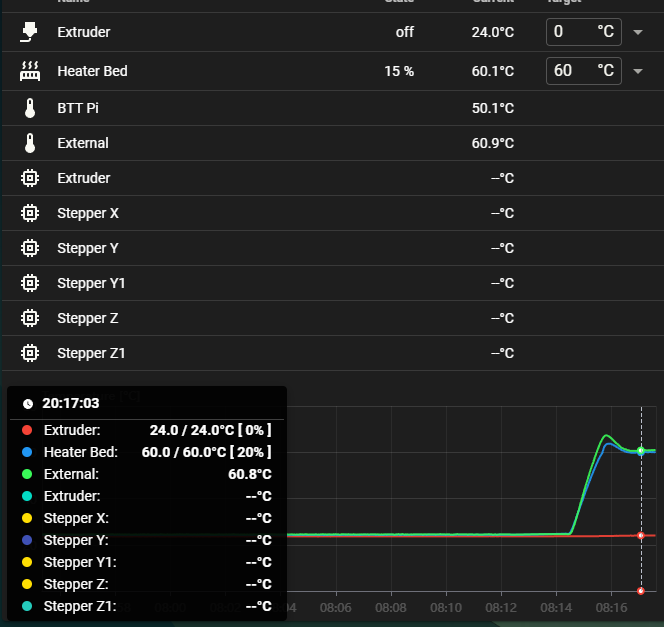

# Table of Contents
- [Table of Contents](#table-of-contents)
- [Specifications](#specifications)
- [Performance](#performance)
- [Installation](#installation)
- [Media](#media)
- [Ordering](#ordering)

 

**Disclaimer**

>*This is a DIY (Do-It-Yourself) experimental project. This PCB is provided "as is" without any guarantees or warranty, and is not certified for any commercial or critical applications. Use it at your own risk. 
The creator assumes no liability for damages or injuries resulting from its use, including but not limited to fire, electric shock, personal injury or property damage.*
>*By using this PCB, you agree to the terms of this disclaimer.*

 

**NOTE: this design is currently in testing**  

  

# Specifications  

 

_This model is also available for purchase from [Provok3d](https://provok3d.com/product-category/printers/lh-stinger/?v=0a10a0b3e53b&sld=211)_

 

**PCB**

- Flex Polyimide Base - as lightweight as possible
- Copper Thickness: 1oz (35 µm)
- Backside Adhesive (Cold Pressed): 3M468MP (Stronger) / 3M90777 (High Temp and easier to apply/remove)
- Silkscreen: White

 

**Power** 

- Voltage:  24V DC
- Resistance: 2.66 Ohm @ 25C (Please see the included Excel screenshot for calculations)
- Power: 216W @ 25C (+-10%)

 
**Thermistor** 
- NTC 100K 3950
   

**Power Cable**

 - 16 AWG Multi-strand Soft Electrical Silicone Cable
 - XT60 female connector
 - Length: 90cm  

 
**Thermistor Cable**

- PTFE/FEP Wire around 24-26 AWG
- 2 pin JST XH 2.54 female connector
- Length: 90cm  
 

>For optimizing your own heater wattage you can use the following calculator. Start with a Trace Width: 2.4mm, Lenght: 13355mm, Thickness: 1oz,   
>https://www.allaboutcircuits.com/tools/trace-resistance-calculator/  

 

  

>Designed with the help of [Róbert Lőrincz](https://www.orbiterprojects.com/)  
>[Story Of The Orbitron Heated Bed Design](https://www.orbiterprojects.com/stories/story-of-the-orbitron-heated-bed-design/) 

   

# Performance

 

* **Heating time to 110C: 2m 58s**     
  

 

* **Bottom thermistor vs top surface thermistor temperature tracking:**      
  

 

# Installation

Please follow this guide: https://github.com/lhndo/LH-Stinger/wiki/Bed-Heater

 

# Media

# Ordering

**[JLCPCB](https://jlcpcb.com)**

❗ **Note:** Add the following instructions to the remark section on the ordering page:  
"ATTENTION: Cold pressing is required for 3M 468MP adhesive application! 
Please consult HeatedBedFoil-B_Stiffener layers for the stiffener locations and specifications."  

 
- Upload HeatedBedFoil_FS_GBR.zip and set the following specifications

