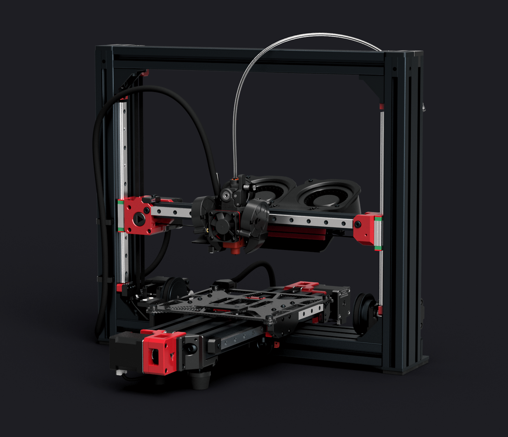
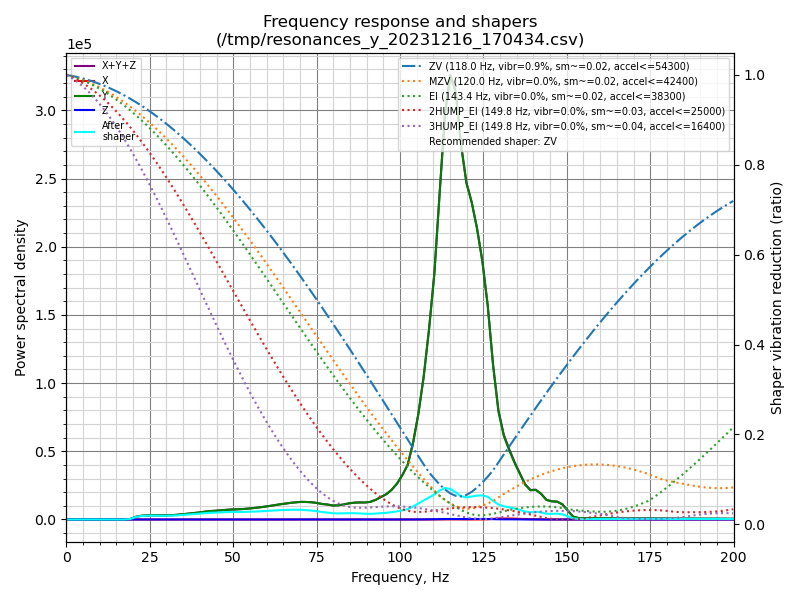

# LH Stinger
   *A no compromise cartesian 3D Printer designed for speed and precision.*

Status: *Beta Testing*

## Features
-

## Credits

_Inspired by the [Annex Engineering](https://github.com/Annex-Engineering) team and [Community](https://discord.com/invite/MzTR3zE), alongside the crazy [Klipper](https://discord.klipper3d.org) people that continue to push bed slingers to the limits. :purple_heart:_

_-Toolhead evolved from an original design by [Dalegaard](https://github.com/dalegaard) 
-Silicon sock mold based on [Renátó Kulman](https://www.printables.com/@RenatoKulman) 
-Wago 221 mounts by [fns720](https://www.printables.com/@fns720) 
-SSR protection cover based on [Technoturk](https://www.printables.com/@Technoturk_377911) 
-3030 extrusion Cable clip based on [Arthur_C](https://www.printables.com/@Arthur_C_428094) 
-3030 t-nut clip based on [John_S](https://www.printables.com/@JohnS) _
