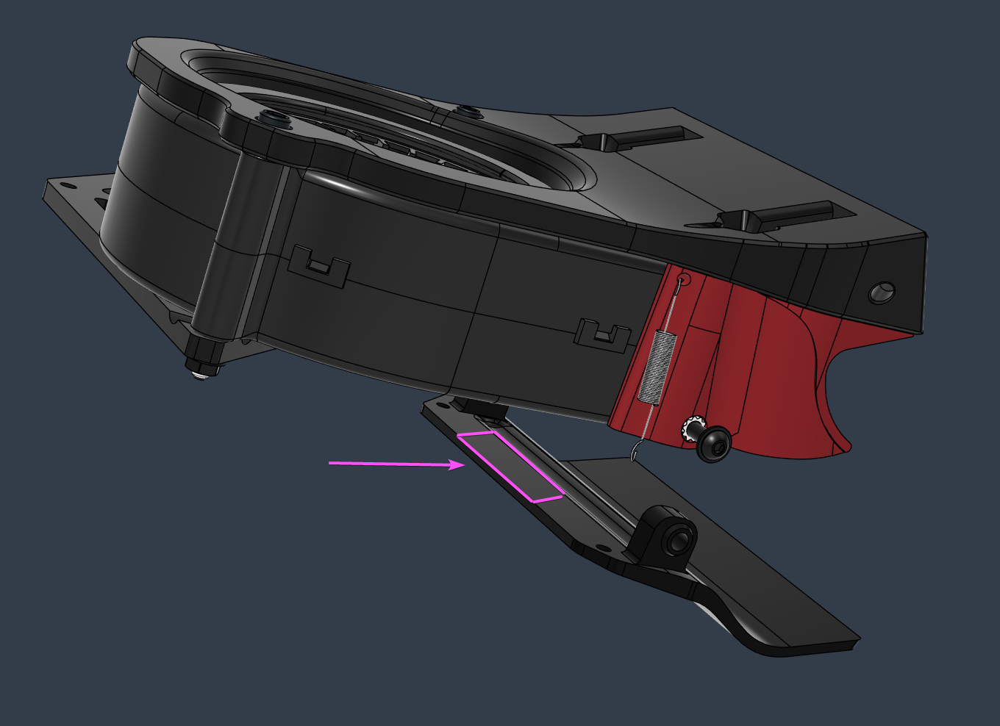

# Adjustable Flaps

These Aux Fan Flap variants are designed at higher tolerances to allow adjusting the flap position against the nozzle location.  
They were mainly designed for thicker 9733 blower fans, but might come useful in other scenarios that differ from the BOM setup.

You can do so by adding a few strips of tape or other matearial against the back part that rests on the bottom of the fan. Doing so you can set the neutral return position of the flap. 

