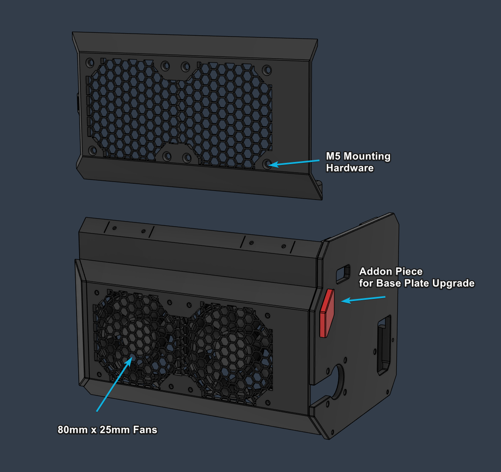

# 80mm Fan - Ebox Door

_Ebox parts for installing 80x25mm fans._

* Use the **Addon Piece** to upgrade from the base version and skip printing **Panel Right**. 
* The **Door Main M5** version requires M5 8mm+ self tapping countersunk screws.

  
