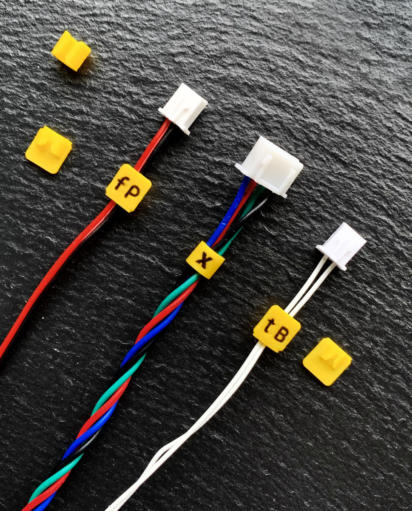
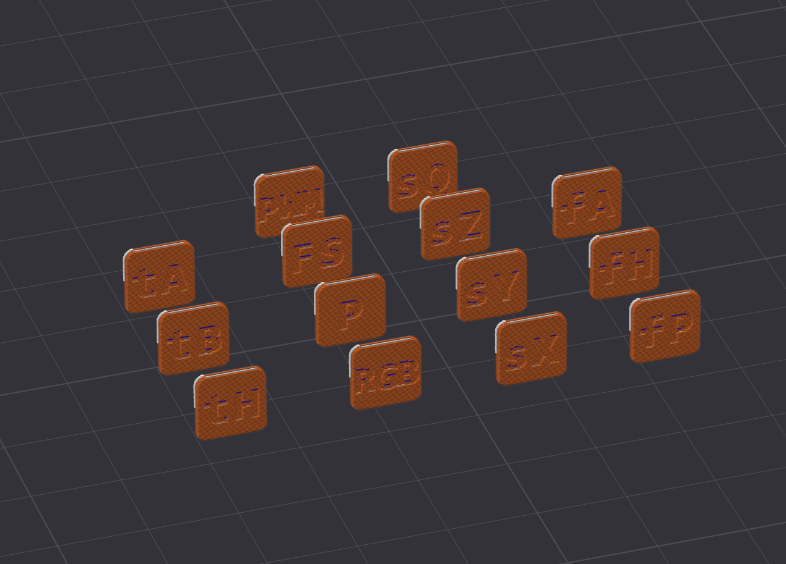
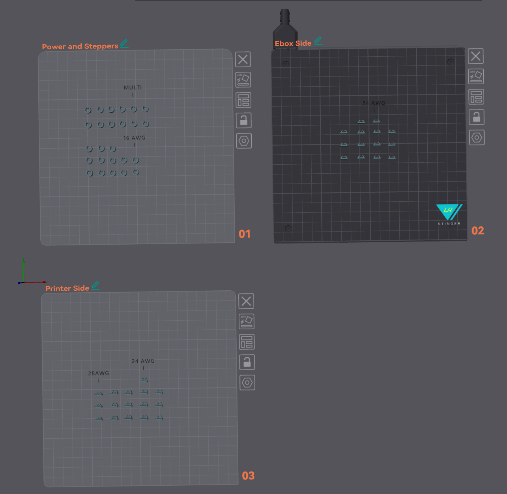

# Cable Labels

- Three versions for 16 AWG, 24 AWG, and 28 AWG wires
- Customizable text authored in Orca Slicer
- Contains most labels needed for the Breakbeat PCB and Wire Harness
- Designed on the tight side to stay fixed. Feel free to scale them if needed

**Requires a very well tuned printer**

*Print slow, and add brim if run into issues (lots of cleanup will be needed if so).  
Be ready to cancel objects if they detach.
Fill in the text with a mechanical pencil, or a very fine Pigment Liner Pen (Sakura Micron 03).*

 

 

