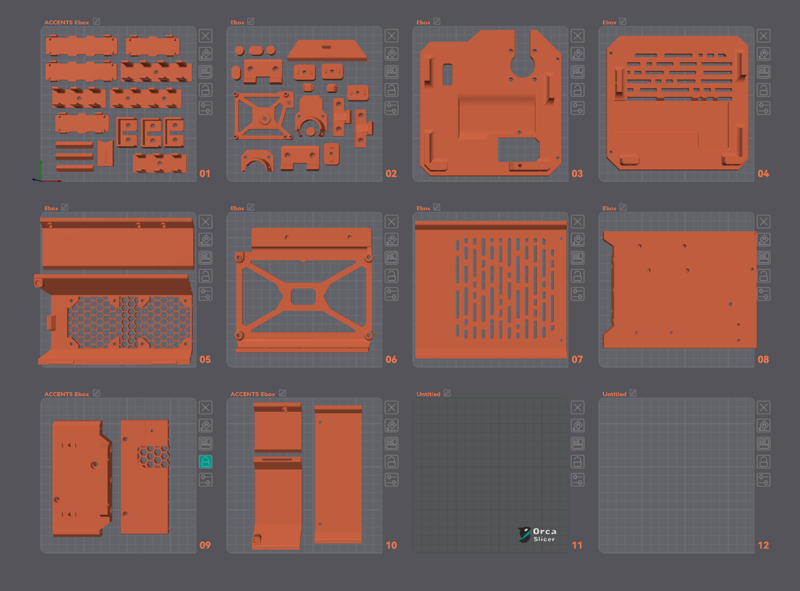

# Ebox - Printable on 180mm Bed

### Extra BOM

* 19pcs 20mm Filament Pins 
*  2x M3 22mm Cap Head Screws
*  2x M3 4x5mm Heat Inserts
  
### Assembly

1. Make sure the pieces fit flush. Sand or file if necessary (also helps with adhesion)
2. Insert the filament pins and dowels, check for fitting and then glue the panel together

