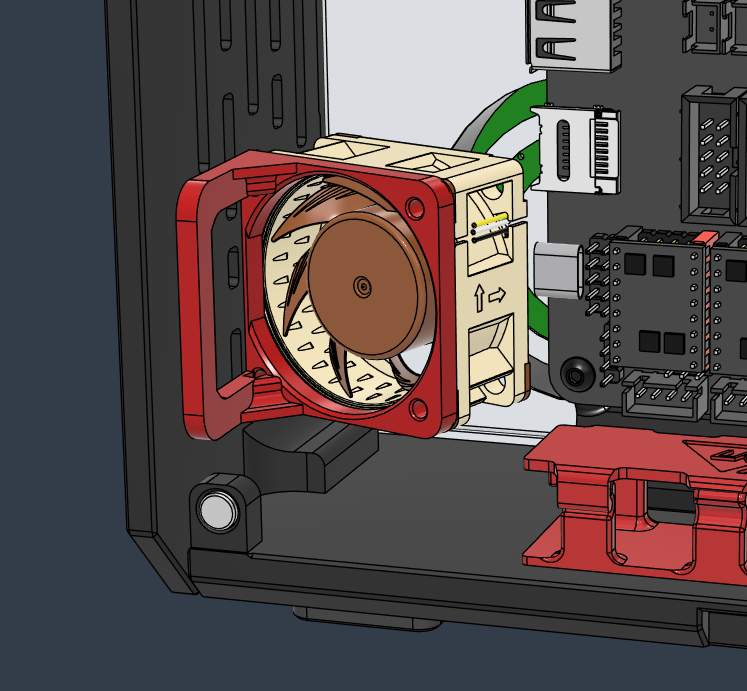

# PSU Fan Booster

Provides additional cooling for noisy PSU fans that kickstart at certain temperature threasholds

- Mounted with VHB tape
- 22mm+ screws that self tapped into the printed mount
- 4010 or 4020 fans (Noctua NF-A4x20 recommended)
- Add the fan port to the ebox multipin section

