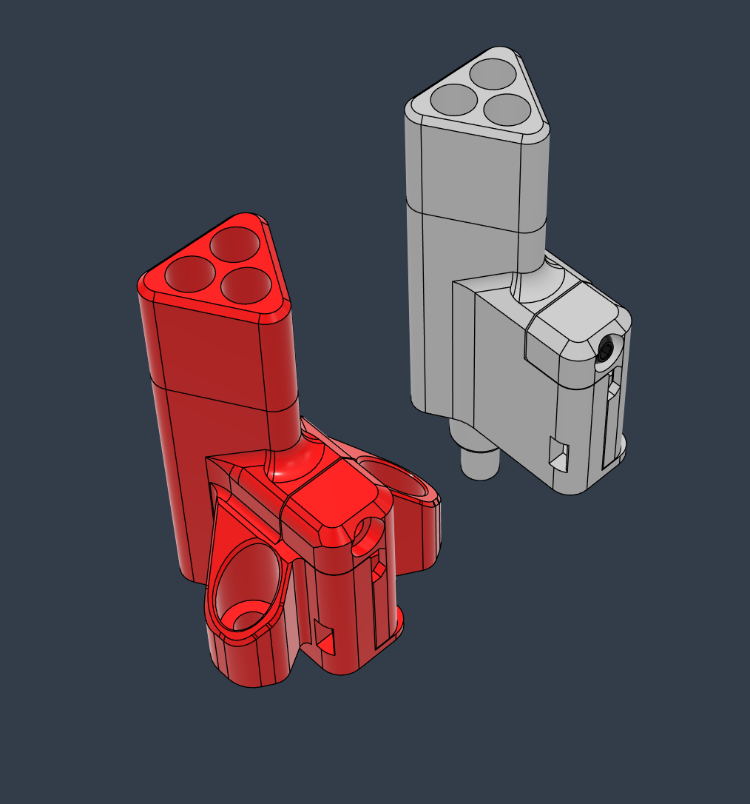

# Toolhead Filament Hub

#### *3-4 Lane* *Toolhead Hub and Filament Sensor for the Orbiter V2 and V2.5 Extruders*

4 Lane version made by ***Amber White***

## BOM

Item | Quantity
-|- 
Kailh Red GM 4.0 Microswitch or equivalent | 1
4mm Ball Bearing (unpack a 608zz) | 1
PTFE tube 4mm OD  | 1
Heat Insert M3 4x5mm  | 2
Screw Cap Head M2 8mm  | 1
Screw Countersunk M3 8mm  | 2

## Print

:exclamation: It is highly recommended to use the print settings included in the Orca Slicer project file. There are many custom settings set per object.   

* 0.12 line height, 0.4mm line width
* 3 perimeters, 95% infill
* Make sure your extrusion multiplier is spot on. The tolerances are very small
* Some slight post processing might be needed. 

