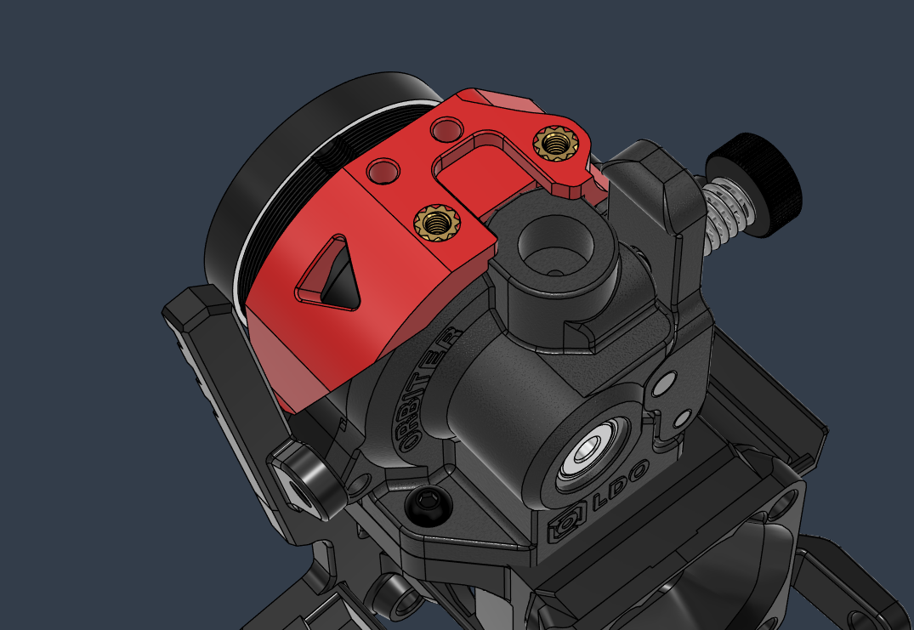
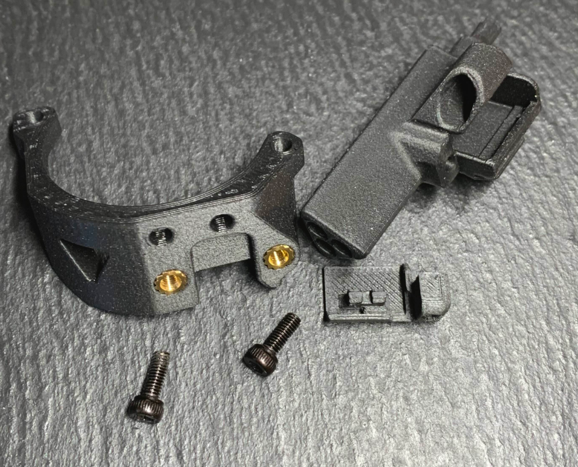
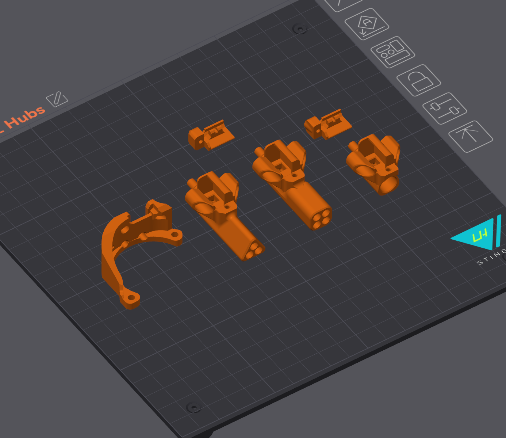

# Toolhead Filament Hub

**Contents:**
  - [BOM](#bom)
  - [Print](#print)
  - [Assembly](#assembly)

 

- #### *3-4 Lane* *Toolhead Hub and Filament Sensor for the [Orbiter V2 and V2.5 Extruders](https://s.click.aliexpress.com/e/_oop9Ovv)*

- #### Floating Hub Variants with ECAS connector

4 Lane version by ***Amber White***

## BOM

Item | Quantity
-|- 
[Kailh Black GM 8.0](https://s.click.aliexpress.com/e/_opzj701) Microswitch or equivalent | 1
[4mm Ball Bearing](https://s.click.aliexpress.com/e/_oEx2nzd) (or unpack a 608zz bearing) | 1
[ECAS 4 Collet](https://s.click.aliexpress.com/e/_DBXcy4h)  (for sensor only version)| 1
[Heat Insert M3 5mm (D) x 4mm (L)](https://s.click.aliexpress.com/e/_Dci6SvT)  | 2
Screw Cap Head M2 8mm  | 1
Screw Countersunk M3 8mm  | 2

* The Stand-alone Filament Sensor uses an [ECAS 4 Collet](https://s.click.aliexpress.com/e/_DBXcy4h) with the rubber grommet removed.

## Print

:exclamation: It is highly recommended to use the print settings included in the Orca Slicer project file. There are many custom settings set per object.   

* 0.12 layer height, 0.4mm line width
* 3 perimeters, 95% infill
* Make sure your extrusion multiplier is spot on. The tolerances are very small
* Some slight post processing might be needed. 

 

## Assembly

Assembly instructions are available on the LH Stinger Wiki: 
https://github.com/lhndo/LH-Stinger/wiki/Pico-MMU#filament-sensor-and-hub
