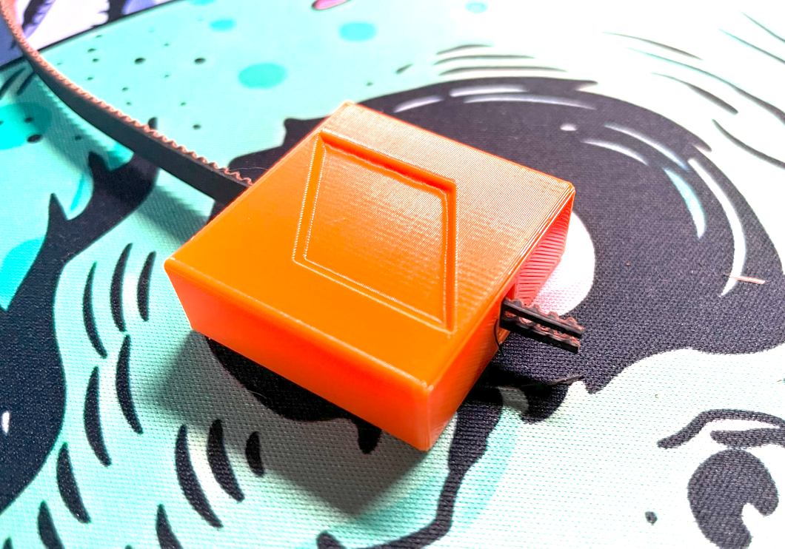
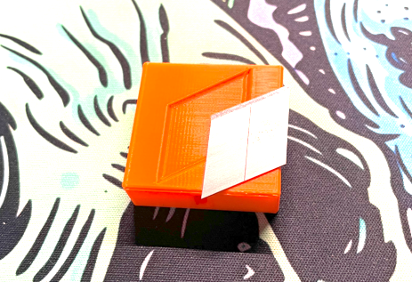
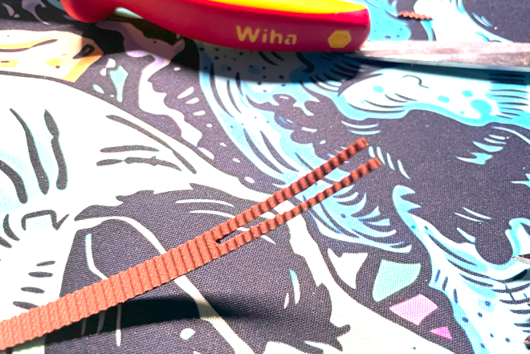
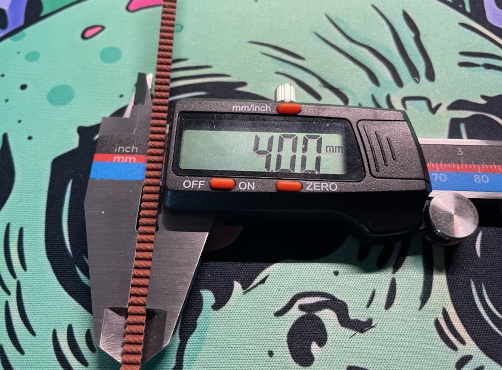

# Belt Cutting Jig

 

1. Take two sections of a large box cutter knife or four sections of a small box cutter knife (new and sharp) and insert them into the jig as shown.
 
    

2. Pre-cut a 50mm long V-shape into the belt with scissors so that you can insert it into the channel all the way through the jig.
   
3. For the first pull, use pliers to get a good grip on the two pieces of belt.
4. Once you have started the cut, you can now pull the belt through by hand (you will still need some force).
