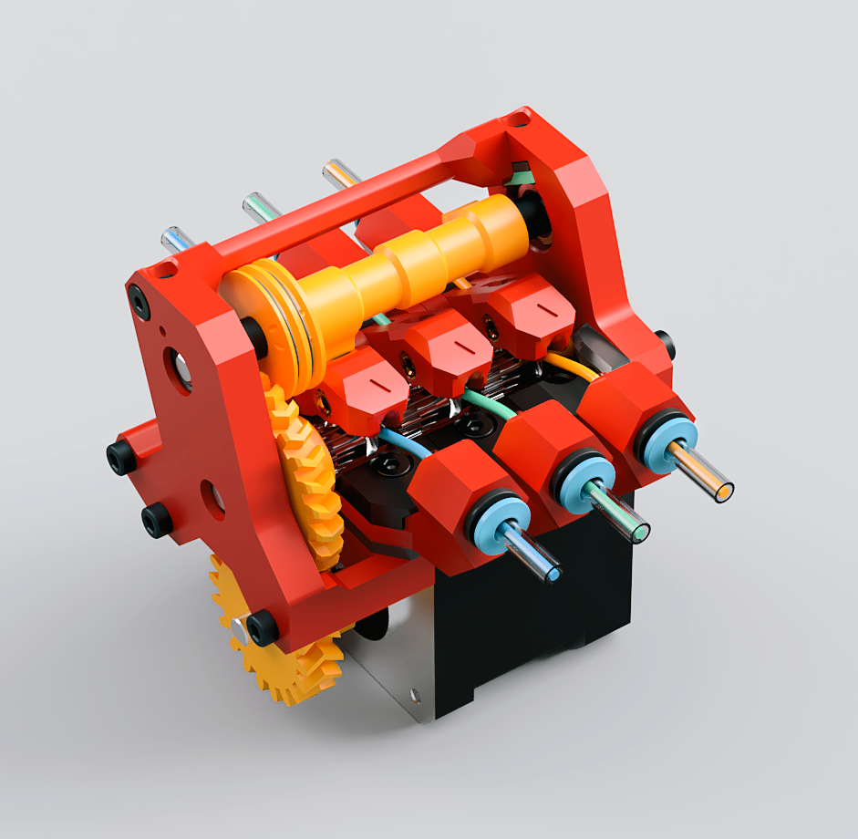

[:arrow_double_down: Download Folder](https://download-directory.github.io/?url=https%3A%2F%2Fgithub.com%2Flhndo%2FLH-Stinger%2Ftree%2Fmain%2FUser_Mods%2FMMU%2FStinger%2520Pico%2520MMU%2520-%2520%2540LH)

# Stinger Pico MMU
*Experimental*

## CAD

[**Online CAD Viewer**](http://tiny.cc/lhs-pico-mu)

## Print

* 3 perimeters, 95% infill - It is highly recommended to use the print settings included in the Orca files 
* Make sure your extrusion multiplier is spot on. The tolerances are very small so print some parts and check for fitting. 
* Some slight post processing might be needed.
* The Idler arms have to be printed top face down on a smooth sheet (not textured PEI) 

The assembly uses two small **TPU** 2mm tabs for pushing force. 
Rubber or silicone patches might also work instead.  

## BOM

Item | Quantity
-|- 
[EMAX ES3004 Servo](https://s.click.aliexpress.com/e/_Dev5Qlb) [(EMAX)](https://emaxmodel.com/products/emax-es3004-17g-3-5kg-0-13sec-23t-metal-gear-analog-servo-for-rc-airplane-es3104-upgrade)  | 1
[Nema 17](https://s.click.aliexpress.com/e/_DDhtjPj) (max 40mm length) | 1
[Steel D-Shaft 5mm x 72mm](https://s.click.aliexpress.com/e/_DEqV7oV)  | 2
[Bearing MR115](https://s.click.aliexpress.com/e/_DeqGPvP)  | 4
[Bearing MR83](https://s.click.aliexpress.com/e/_DDpZxF7)  | 3
[BMG Drive Gear](https://s.click.aliexpress.com/e/_DErKaQz)  | 3
[PTFE Tube 4mm OD, 3mm ID](https://s.click.aliexpress.com/e/_DCqpjY5)  | 1
[ECAS 4 Collet](https://s.click.aliexpress.com/e/_DBXcy4h)  | 6
[Kevlar or Low Stretch Braided Fishing Line](https://s.click.aliexpress.com/e/_DdfdWYt) ~0.4mm | 1
[Heat Insert M3 5mm (D) x 4mm (L)](https://s.click.aliexpress.com/e/_Dci6SvT)  | 17
Screw Cap Head M3 10mm  | 2
Screw Cap Head M3 22mm  | 2
Screw Cap Head M3 30mm  | 2
Screw Cap Head M3 8mm  | 2
Screw Countersunk M3 10mm  | 9
Screw Countersunk M3 16mm  | 2
Screw Countersunk M3 8mm  | 1

**Notes:**  
*You will also need a free stepper driver on your mainboard, or an ERCF EASY BRD or EBB42 board*  
*[A filament hub and a toolhead filament sensor is also required](https://github.com/lhndo/LH-Stinger/tree/main/User_Mods/MMU/Filament%20Hub%20-%20%40LH)*

 

## Documentation

**Wiki:**
https://github.com/lhndo/LH-Stinger/wiki/Pico-MMU

For support please join the [LH Stinger Discord](https://discord.gg/EzssCfnEDS)
