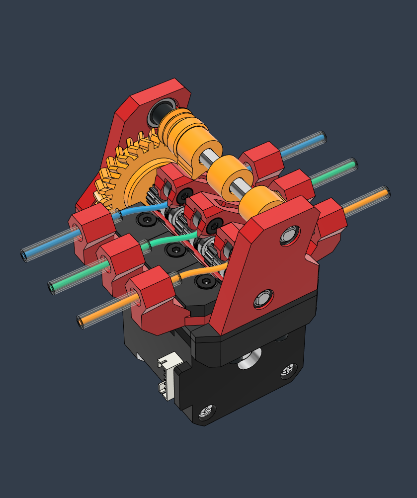

# Stinger Pico MMU
*Experimental*

## CAD

[**Online CAD Viewer**](http://tiny.cc/lhs-pico-mu)

## Print

* 3 perimeters, 95% infill - It is highly recommended to use the print settings included in the Orca files 
* Make sure your extrusion multiplier is spot on. The tolerances are very small so print some parts and check for fitting. 
* Some slight post processing might be needed.
* The Idler arms have to be printed top face down on a smooth sheet (not textured PEI) 

The assembly uses two small **TPU** 2mm tabs for pushing force. 
Rubber or silicone patches might also work instead.  

## BOM

Item | Quantity
-|- 
[EMAX ES3004 Servo](https://emaxmodel.com/products/emax-es3004-17g-3-5kg-0-13sec-23t-metal-gear-analog-servo-for-rc-airplane-es3104-upgrade)  | 1
Nema 17 (LDO-1684AC 40cm) | 1
Steel D-Shaft 5mm x 72mm  | 2
Bearing MR115  | 4
Bearing MR83  | 3
BMG Drive Gear  | 3
PTFE Tube 4mm OD, 3mm ID  | 1
ECAS 4 Collet  | 6
Kevlar or Low Stretch Braided Fishing Line ~0.3mm | 1
Heat Insert M3 4x5mm  | 17
Screw Cap Head M3 10mm  | 2
Screw Cap Head M3 22mm  | 2
Screw Cap Head M3 8mm  | 2
Screw Countersunk M3 30mm  | 2
Screw Countersunk M3 22mm  | 2
Screw Countersunk M3 10mm  | 9
Screw Countersunk M3 16mm  | 3
Screw Countersunk M3 8mm  | 1

 

## Assembly

**Notes**   

* The entire assembly can be done off the stepper motor, and mounting that in the end.
* Lube the printed herringbone gears with Super Lube

**Winch Assembly**

*The pulley stack is more tricky to set up. Look at the CAD and try to understand its functioning mechanism.*

1. Tie two threads of wire to the CAM pulley 
2. Tie the other ends to the two smaller stepper pulleys
3. Loop the wires over the CAM pulley as shown in the CAD assembly
4. Close both sides of the assembly which holds the bearings in place
5. Install the printed CAM alignment guide that sets the 0 position
6. Power on the stepper and set the angle to 0 (it is usually 0 when it receives power)
7. Roll the first pulley while bringing it closer to the servo shaft.
8. With the string tensioned, insert the pulley into the geared shaft
9. Repeat the procedure with the second pulley
10. Finish by tightening the screw that holds the pulley stack onto the servo shaft  

*Video available on Discord (for now)*

For support please join the [LH Stinger Discord](https://discord.gg/EzssCfnEDS)