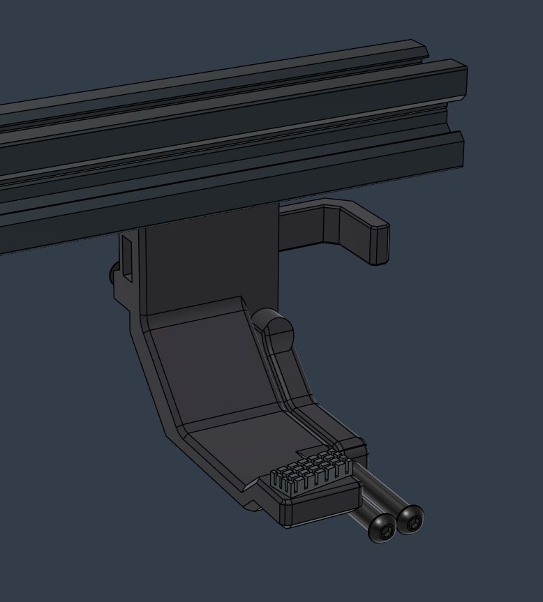
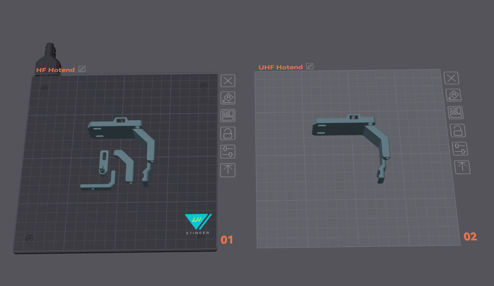

## Brush Purge Dock

## BOM

Item | Quantity
-|- 
Button Head M3 10mm  | 3
Button Head M3 12mm  | 1
Button Head M3 30mm  | 2
[A1 Mini Silicone Brush](https://s.click.aliexpress.com/e/_oCtyVVf) | Cut in half = 14mm
PTFE OD:4mm ID:3mm  | 20mm x 2
Elastic Band  | 1

## Assembly

* Add a dot of superglue on the tip of the screw that acts like the Pin, and onto the rotating arm where it interfaces with the slot piece.

## Setup

Please see **brush.cfg** for instructions