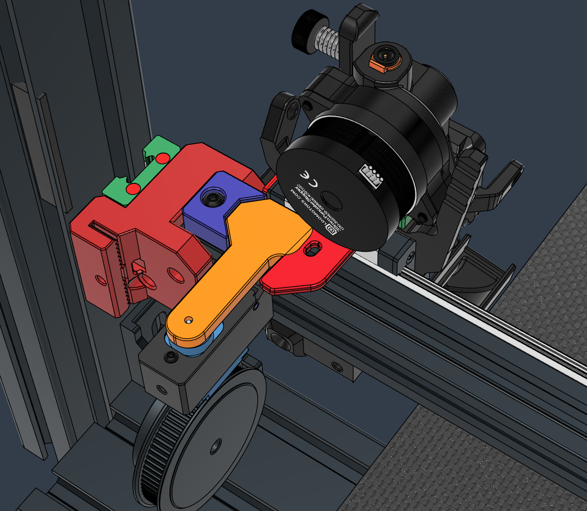
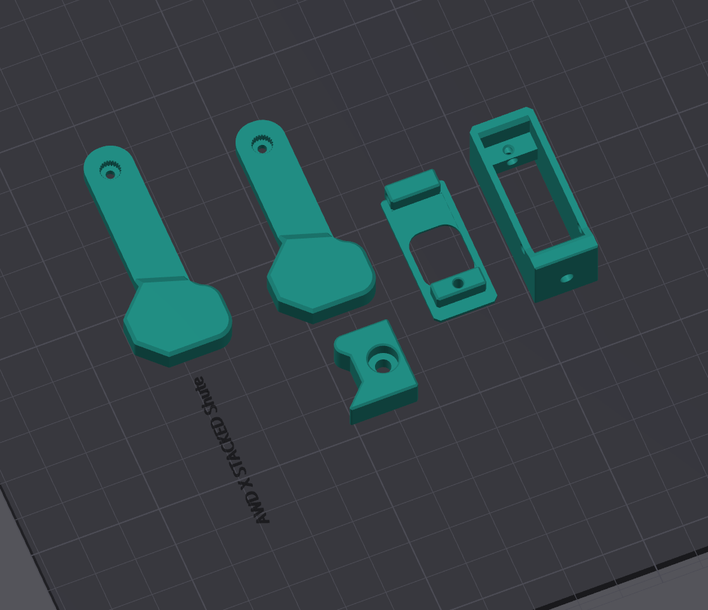
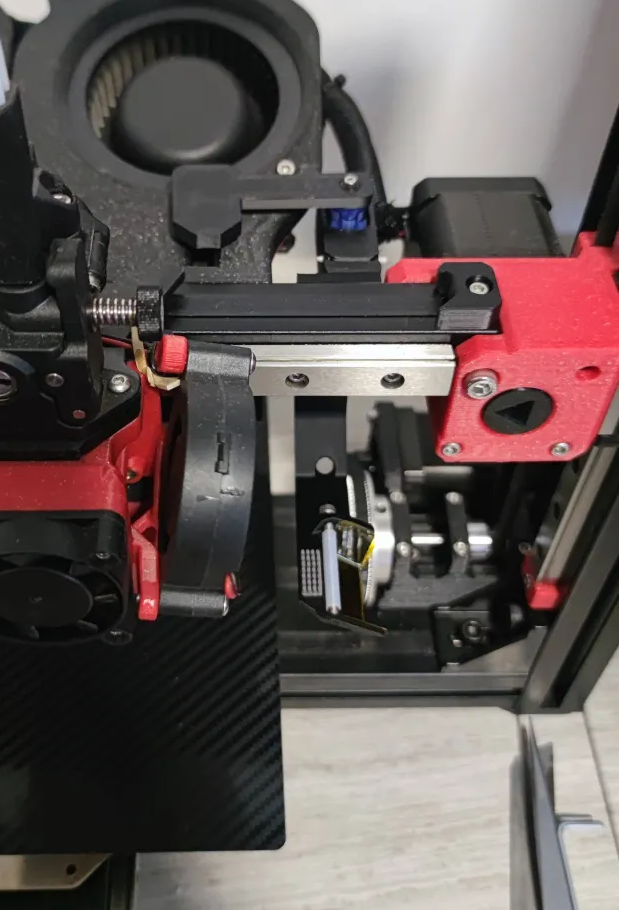

## Hammer Stop Cut
*by Dan329*

Servo controlled filament cutter stopper for printers with restricted X travel (AWD X configurations)




## BOM

Item | Quantity
-|- 
SG90 Servo or equivalent  | 1
Screw Button Head M3 12mm  | 1
Screw Countersunk M3 8mm  | 1
Screw Button Head M2/2.5 12mm+  | 1
2020 M3 T-Nut Insert   | 2


## Print

Solid



## Mini Purge Shute - AWD X

In that configuration the servo is mounted on top of the Shute mount.  
You also need to use the longer "Hammer" arm.




## Gcode

- Add to `sp_mmu.cfg`

```
[servo flipstop_servo]
pin: PD1                          ## Define your hammer servo pin here
initial_angle: 0
maximum_servo_angle: 180
minimum_pulse_width: 0.000500
maximum_pulse_width: 0.002500

[delayed_gcode _FLIP_OFF]
initial_duration: 2
gcode:
  SET_SERVO SERVO=flipstop_servo ANGLE=0
  G4 P1200
  SET_SERVO SERVO=flipstop_servo WIDTH=0
```

<br>

- Replace `_SP_TIP_FORM` in `sp_mmu.cfg`  

```
[gcode_macro _SP_TIP_FORM]   ## Filament Cut Macro
variable_cut_position_x: 230
variable_cut_position_y: -99  ## -99 means no movement
variable_clear_position_x: 200 
variable_clear_position_y: -99 ## -99 means no movement
variable_approach_speed: 400
variable_cut_speed: 140
variable_filament_retract_speed: 130
variable_z_hop: 0.4

gcode:  
  
   
  
  
  RESPOND MSG="SP: Filament Cut"

  
    G28 X Y
  
  G90
  M83

  
    G0 Z{hop}    ## Z Hop
  
  

  
    
    

  
    
    

  G0 {clear_move} F{60*approach_speed}                      ## Approach clear position
  
  SET_SERVO SERVO=flipstop_servo ANGLE=92                   ## Servo In
  G4 P1200
  
  G0 E-{fil_cut_position} F{60*filament_retract_speed}      ## Retract filament close to the cutter blade
  G0 {cut_move} F{60*cut_speed}                             ## Move to cut
  G0 {clear_move} F{60*cut_speed}                           ## Move back to clear position
  
  M400
  SET_SERVO SERVO=flipstop_servo ANGLE=0                    ## Servo Out
  G4 P1200
  SET_SERVO SERVO=flipstop_servo WIDTH=0

  G0 {sp.park_x} F{60*park_speed}                           ## Parking on X


```

