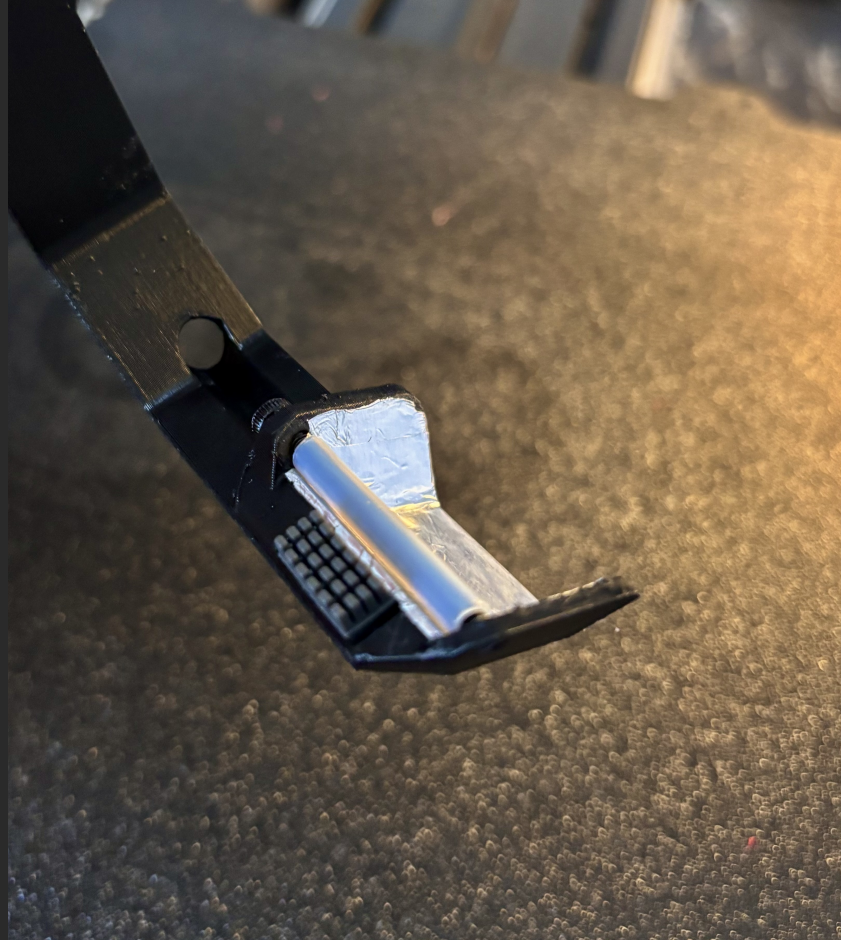
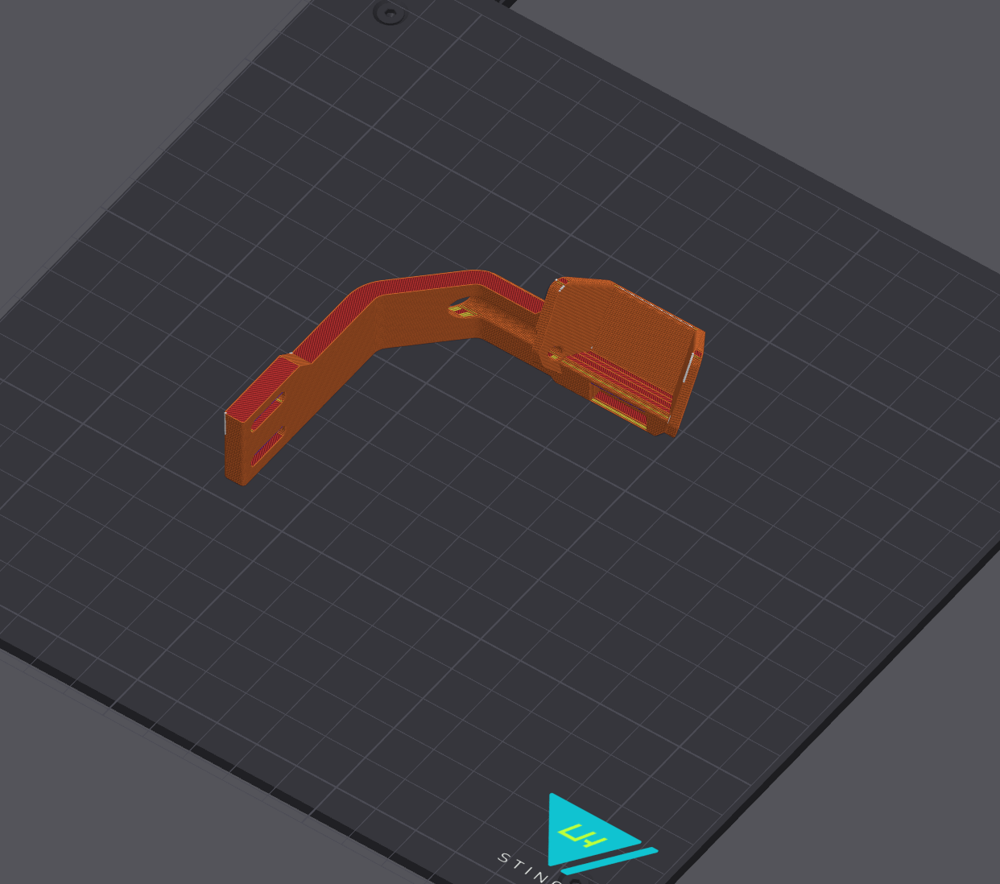

## Mini Purge Shute

Tiny passive purge shute that works with the filament cutter endstop.




## BOM

Item | Quantity
-|- 
Aluminium Foil   | 1
PTFE OD:4mm ID:3mm  | 25mm
[A1 Mini Silicone Brush](https://s.click.aliexpress.com/e/_oCtyVVf) | Cut in half = 14mm
2020 M3 T-Nut Insert   | 2
Screw M3 35mm  | 1
Screw Button Head M3 8mm  | 2


## Print

Pick between the HF and UHF variants




## Assembly

Glue the foil or use aluminium tape. Add two layers on the bottom surface.  
Position it so that it sits 2mm to the right of the bed, and that the nozzle slightly pushes on the PTFE 


## Gcode
- In **sp_mmu.cfg** set  **variable_use_park: 1** and **variable_park_purge: 1**
- Set **variable_purge_speed: 18** (or test other values), and **variable_park_x** slightly to the right of the center of the PTFE tube
- Under advanced settings set **variable_skip_first_park: 1** if using a filament cutter
- Disable the wipe tower in Orca Slicer

- Replace `_SP_PURGE` in `sp_mmu.cfg` and adjust the values if needed  


```
[gcode_macro _SP_PURGE]   ## Called whenever a purging action is performed
variable_brush_left_pos = 215  ## X nozzle position to the left of the brush
variable_brush_speed = 150
variable_brush_cycles = 4
variable_pause = 1000          ## ms - pause between brush cycles 
variable_min_purge = 30        ## minimum amount of purge
variable_max_blob_size = 80    ## max mm of filament in each blob, set to 999 to disable multiple blob sequences
variable_fan_speed = 0         ## fan speed during purge 0 - 255

gcode:  
  
  
  
  G90

  ## Park with Conditional Homing if enabled
  
    _SP_CONDITIONAL_HOME AXIS=XY
    _SP_PAUSE_PARK SKIP_Z=1   ## Select your park moves depending on your requirements
    G0 X{sp.park_x} F{60*brush_speed}  ### Move to purge park position
   

  ## Verify heating
  _SP_HEAT_HOTEND

  ## Fan
  
  M106 S{fan_speed}   ## Set fan speed during purge

  ## Purge cycles
  
  RESPOND MSG="SP: Purging {purge}mm of filament broken in {purge_cycles} cycles"
  M400

  
   
    
    ## Purge  
    
    G1 E{purge_now} F{60*(sp.purge_speed/2.4)}  ## Conversion from mm3/s to mm/s 
    G0 E-0.4 F{35*60}   ## Retract
    
      
    ## Brush
    G4 P{pause} # Wait 
    
        G0 X{brush_left_pos-10} F{60*brush_speed}  ## Left side of the brush position
        G0 X{sp.park_x} F{60*brush_speed}
    

  
  
  ## Restore Fan
  M106 S{saved_fan_speed}
  G0 X{brush_left_pos-5} F{60*brush_speed}  ## Final end position
  G0 E-0.4 F{35*60}   ## Retract

```