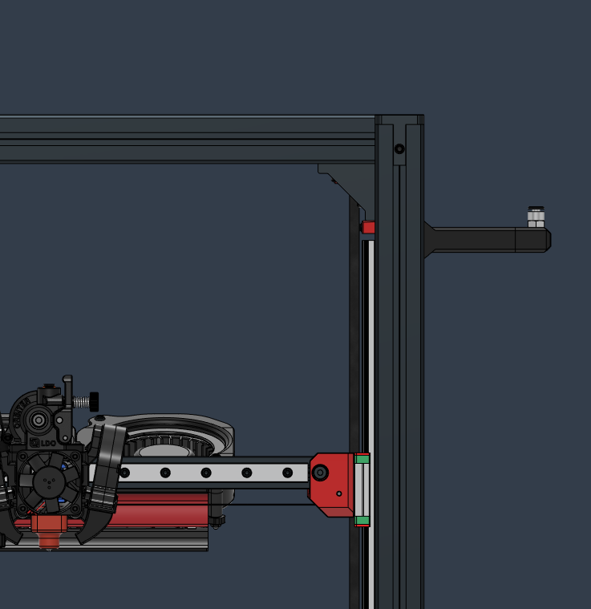
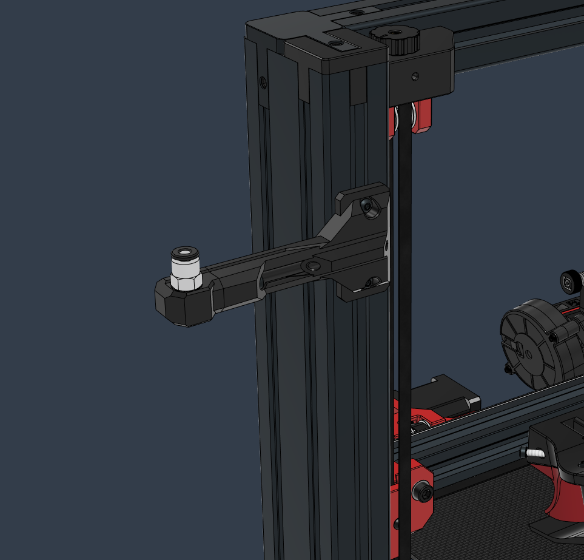

# Side Arm Bowden Coupler

_Optimized filament path for spools that sit on the side of the printer._  

- The rotating coupler head is fixed with a M3 22mm Socket Head Screw
- Uses a a PC4-M10 Pneumatic Connector

 

