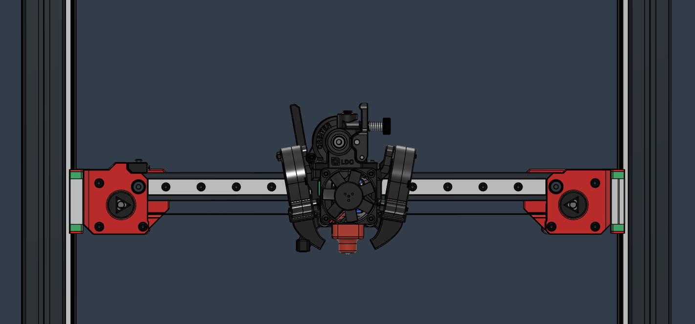
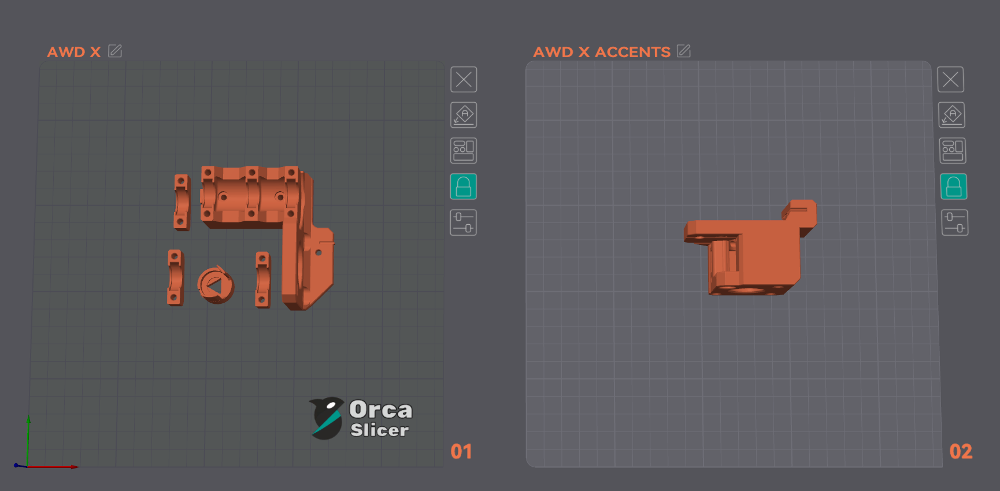
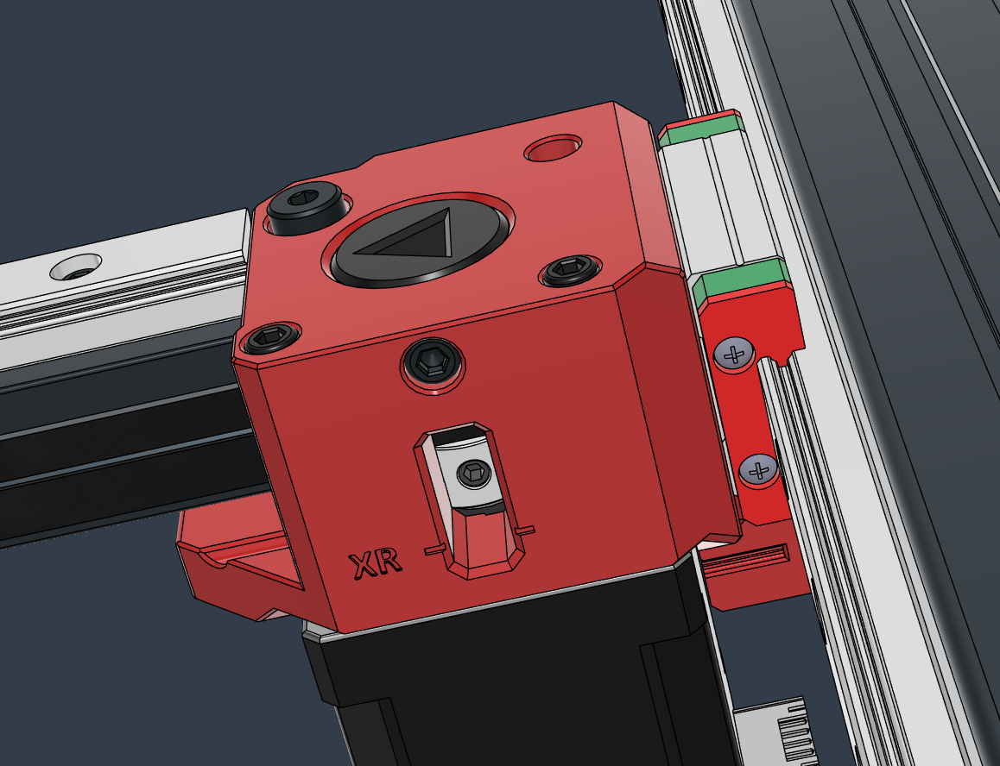
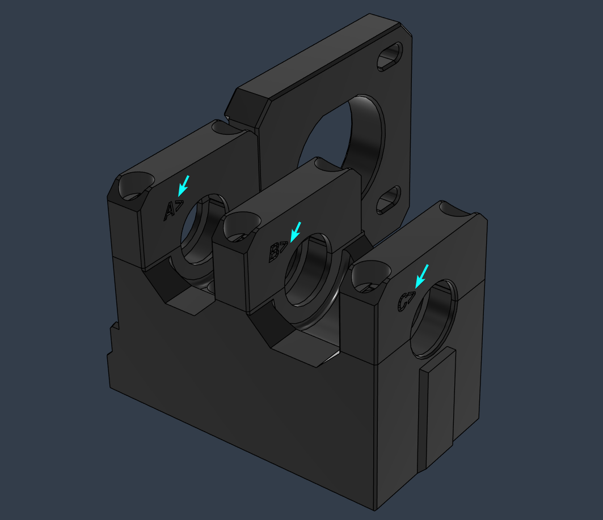
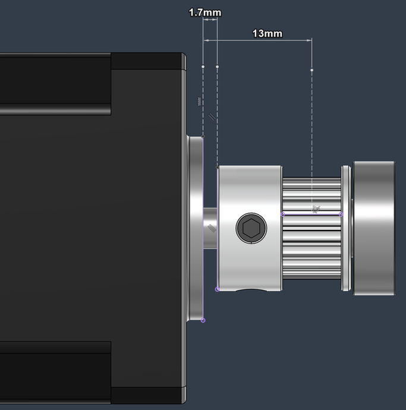
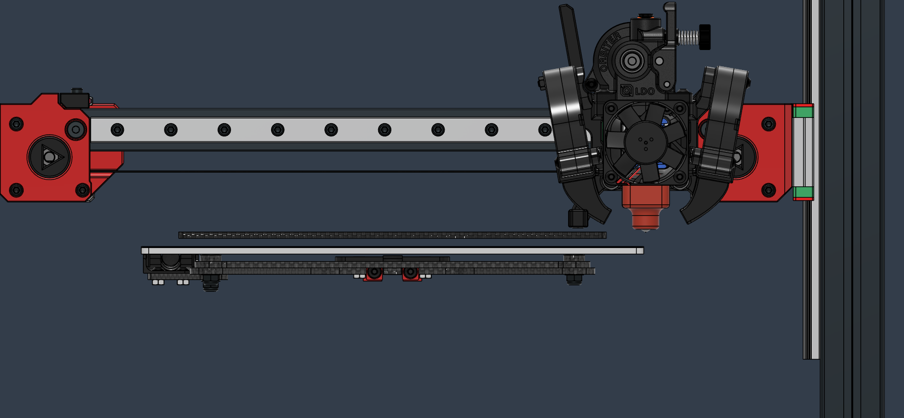

## X AWD

**Contents:**

  - [Parts Required](#parts-required)
  - [Printed Parts](#printed-parts)
  - [Assembly](#assembly)
  - [Belt Tension](#belt-tension)
  - [Stepper Sync](#stepper-sync)
  - [Notes](#notes)

 

 

### Parts Required

* :exclamation: Stepper motors, stepper drivers and pulleys have to be identical to their left counterparts.
* The pulleys on the LH Stinger were sourced specifically to match the required dimensions, the correct belt profile and the desired quality.  
(Gates or Runice pulleys are highly recommended)

   

*Existing parts from the single X configuration were not excluded from tables below.*  

 

**Driver**

| Type | Item  |  Quantity |
|---|---|---|	
Driver | TMC 2240| 1
Wiring | Stepper Motor Cable | 1

 

**AWD X Gantry**

| Type | Item  |  Quantity |
|---|---|---|	
Extrusion | 2020 - 204 mm| 1
Linear Rail | MGN12H - 282 mm | 1

 

**AWD X Right Mount**

| Type | Item  |  Quantity |
|---|---|---|	
Motor | LDO Nema_17_42STH48-2504AC| 1
Pulley |2GT-20T - For 6mm Belt| 1
Bearing | 625 2RS | 1
Heat Insert | M3 Short 5x4 | 1
T-Nut - Square | 2020 - M5 | 2
Hex Nut | M3 | 1
Shim | 7 x 5 x 0.5mm | 2
Shim | 10 x 5 x 1mm | 1
Screw Socket Head | M3 14mm | 2
Screw Socket Head | M3 12mm | 1
Screw Button Head | M3 10mm | 3
Screw Socket Head | M3 22mm | 1
Screw Socket Head | M3 35mm | 2
Screw Button Head | M3 12mm | 1
Screw Socket Head | M5 10mm Low Head | 1
Screw Socket Head | M5 12mm | 1

 

**AWD Z Right Mount**

| Type | Item  |  Quantity |
|---|---|---|	
 Motor | Nema 17 LDO-42STH40-1684AC | 1
Pulley |  2GT-20T 6mm | 2
Pulley | 80T 6mm | 1
Bearing | 625 2RS | 3
Shim | 10 x 5 x 1mm | 4
Shaft | D Shape -  72mm x 5mm | 1
Belt | 2mgt 6mm 188mm Closed Loop | 1
Heat Insert | M3 Long 4.6x5.7 | 6
T-Nut Drop In | 3030 - M3 | 3
Washer | M4 9 x 0.5mm | 1
Washer | M3 7x0.5mm | 6
Screw Socket Head | M3 12mm | 4
Screw Socket Head | M3 22mm | 2
Screw Socket Head | M3 30mm | 6

 

### Printed Parts

An Orca Slicer **AWD X.3mf** project file is available in the files above. 

 

### Assembly

Please follow the instructions of the left counterparts in the main [Assembly Guide](https://github.com/lhndo/LH-Stinger/wiki/Assembly-Guide) 

* [X Mount Assembly](https://github.com/lhndo/LH-Stinger/wiki/Assembly-Guide#x-mounts)
* [Z Mount Assembly](https://github.com/lhndo/LH-Stinger/wiki/Assembly-Guide#z-mount-assembly)

**Note:**
* Markings are embedded on each part for identification. 

* The bearing clamps require a specific orientation and order
  

 

* The X motor pulley requires a 1.7mm offset from the stepper face, with the middle of the belt sitting at a 13mm offset  
* :exclamation: The right side pulley is mounted with the grub screws on the round part of the shaft on the right stepper motor, otherwise the stepper cannot be synced together
    * Make a mark with a Sharpie at the end of the motor shaft to indicate the flat D slot location

 

### Belt Tension

* Move the carriage all the way to the left
* Loosen both grub screws on the right pulley
* Tension the belt to 116hz (~6.5 lbf over a **256mm** measured belt span)
* Perform the X Stepper Sync procedure and tighten the grub screws at the end

For more information please consult the [Tuning - Belt Tension Guide](https://github.com/lhndo/LH-Stinger/wiki/Tuning#belt-tension)

  

### Stepper Sync

* The X stepper sync procedure is performed on the right side of the mount
  * Perform Z-Tilt procedure first, then raise the gantry to the top of the printer
  * Loosen the grub screws though the bottom access window of the mount
  * Perform the sync procedure as described in the [Tuning Guide - Syncing Stepper Motors](https://github.com/lhndo/LH-Stinger/wiki/Tuning#syncing-stepper-motors)

 

### Notes

* 100% nozzle coverage is maintained on the 235mm bed, with some probe dead zone on the right edge

 