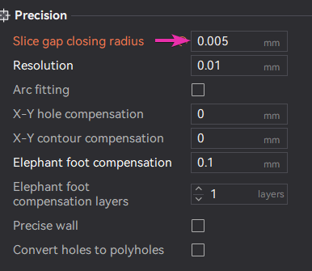
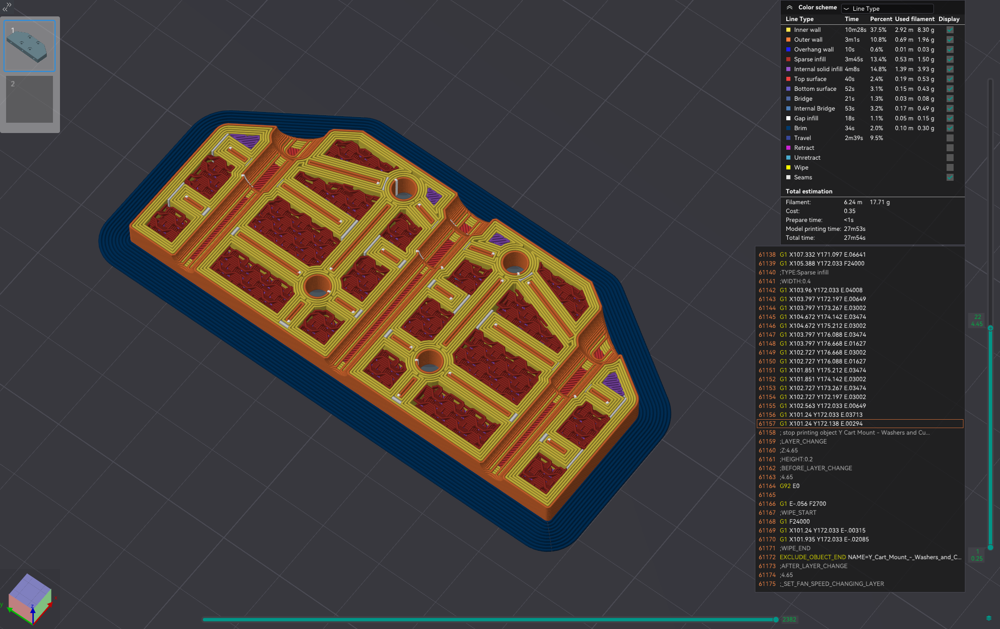
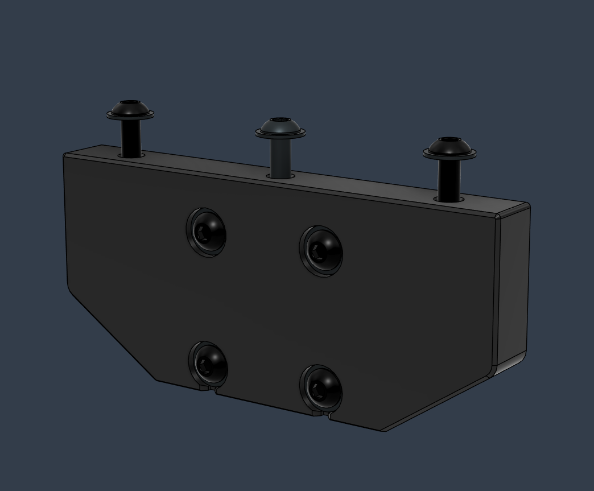
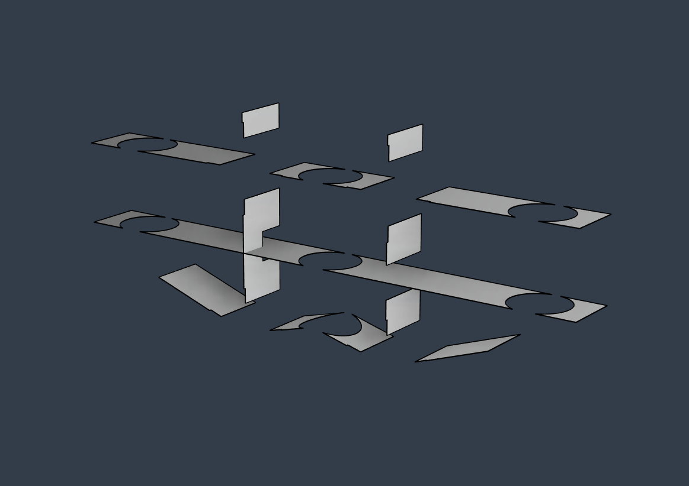

# Y Optimized Cart Mounts
_Micro optimized models for increased stifness_

* Requires 8pcs M3 x 7mm x 0.5mm washers
* Use the slicer settings below, or the 3mf project to ensure correct perimeter generation which takes advantage of the internal micro optimizations.

 
