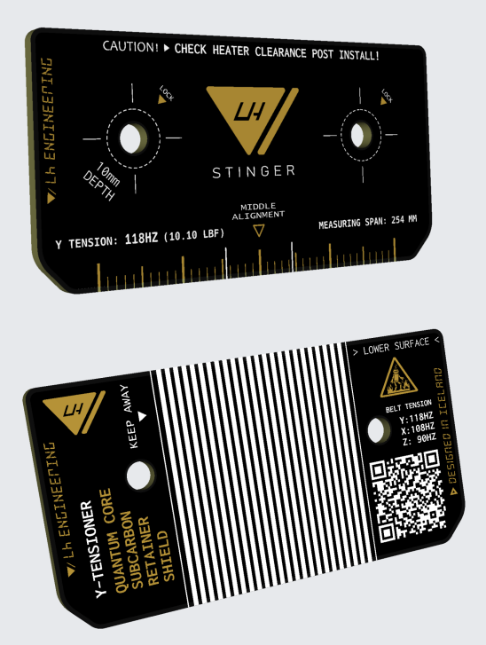
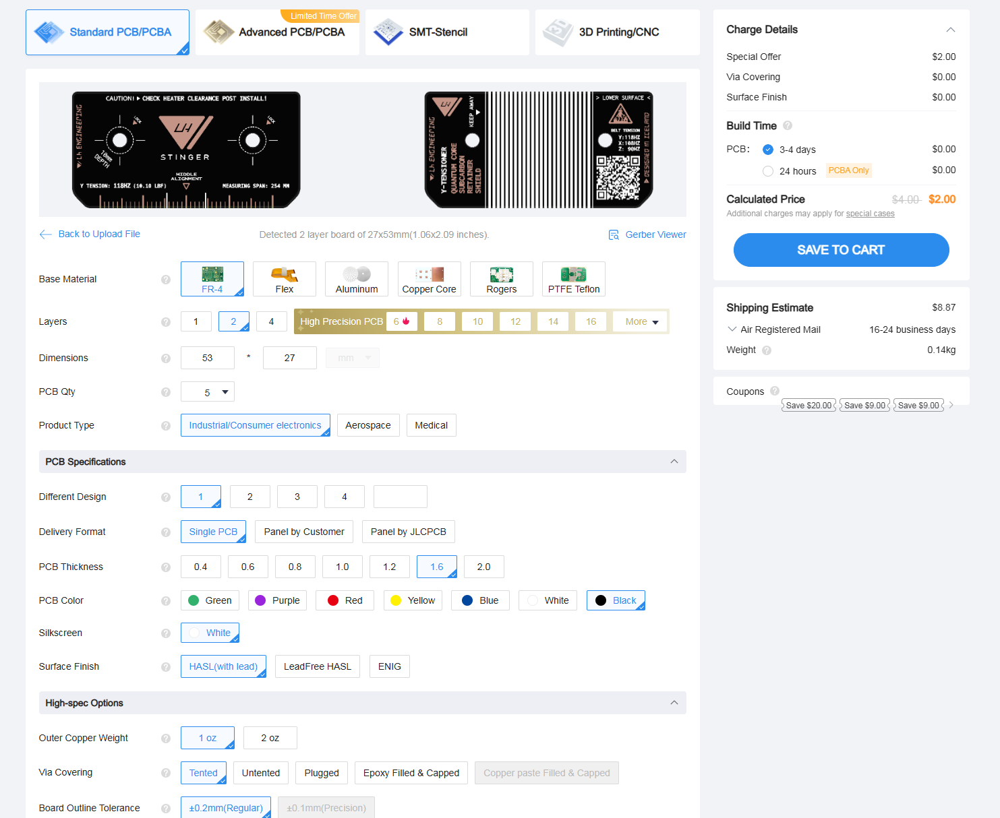
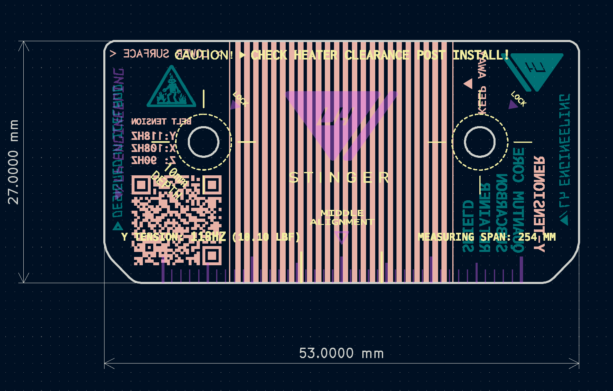
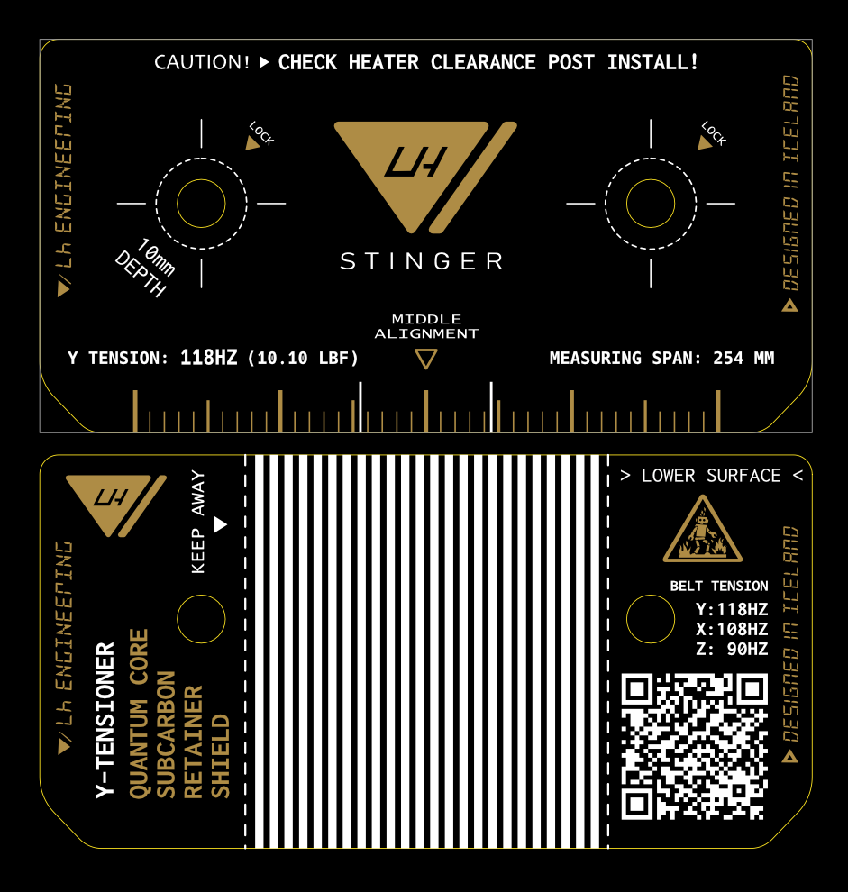

# Y Tensioner PCB Retailer Plate

Replaces the printed plate holding the Y tensioner block and provides better stiffness and temperature resistance.

## Installation

* Mount with two M3 10mm Button Head Screws
* Check for clearance between the top of the screws and the heater 
 

## Ordering

1. Upload Gerber.zip to jlcpcb.com
2. Choose your color
3. Set "Mark on PCB: Remove Mark"

 

 

## Images

