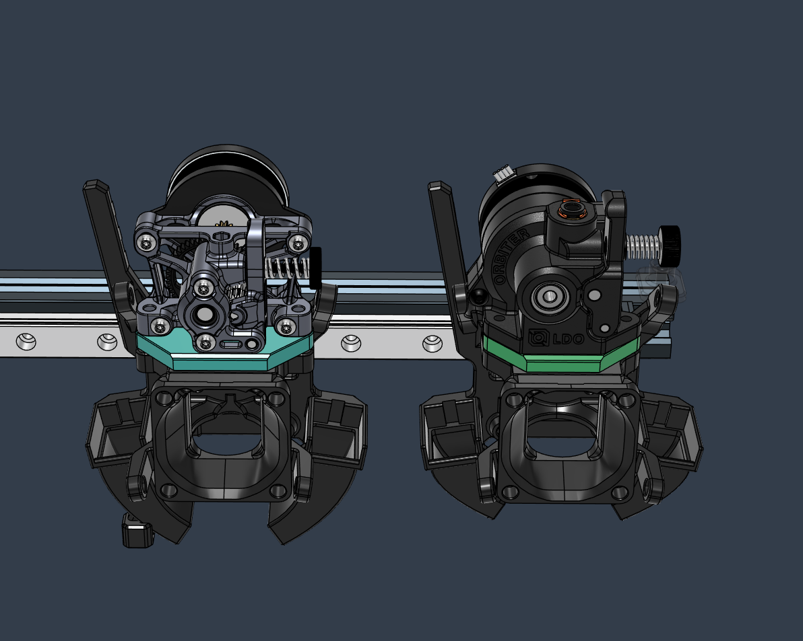
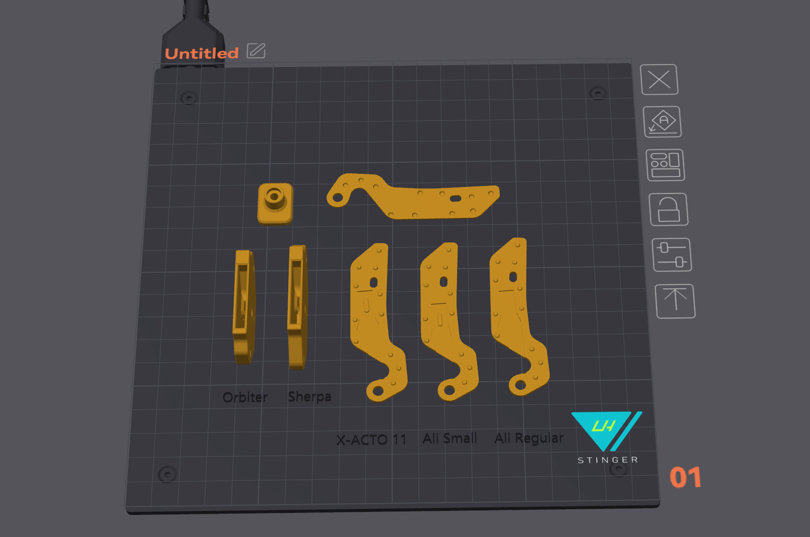
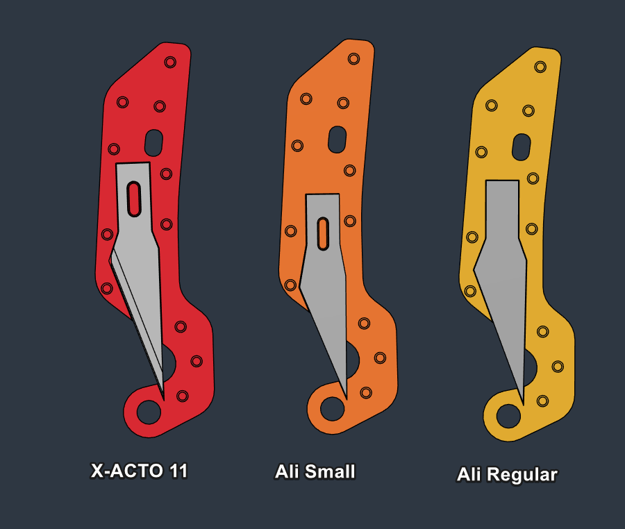
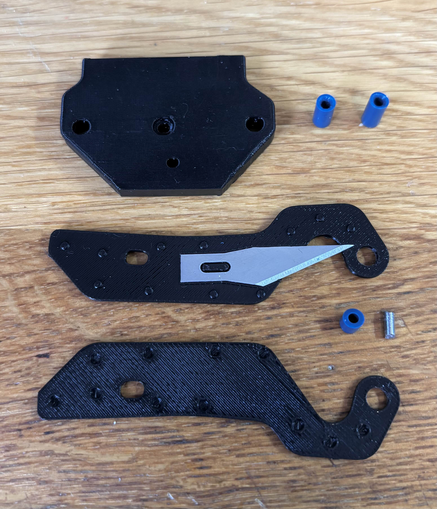
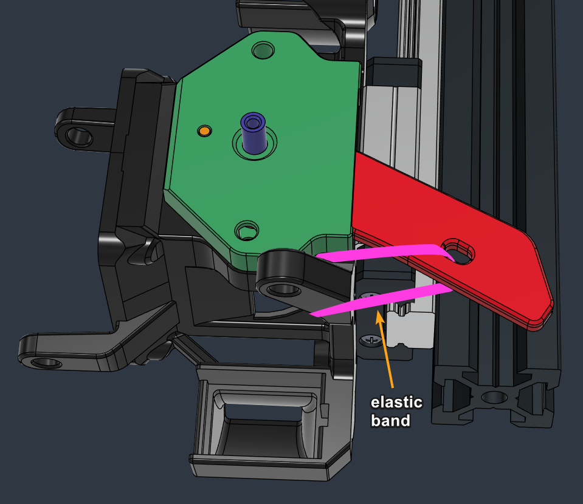
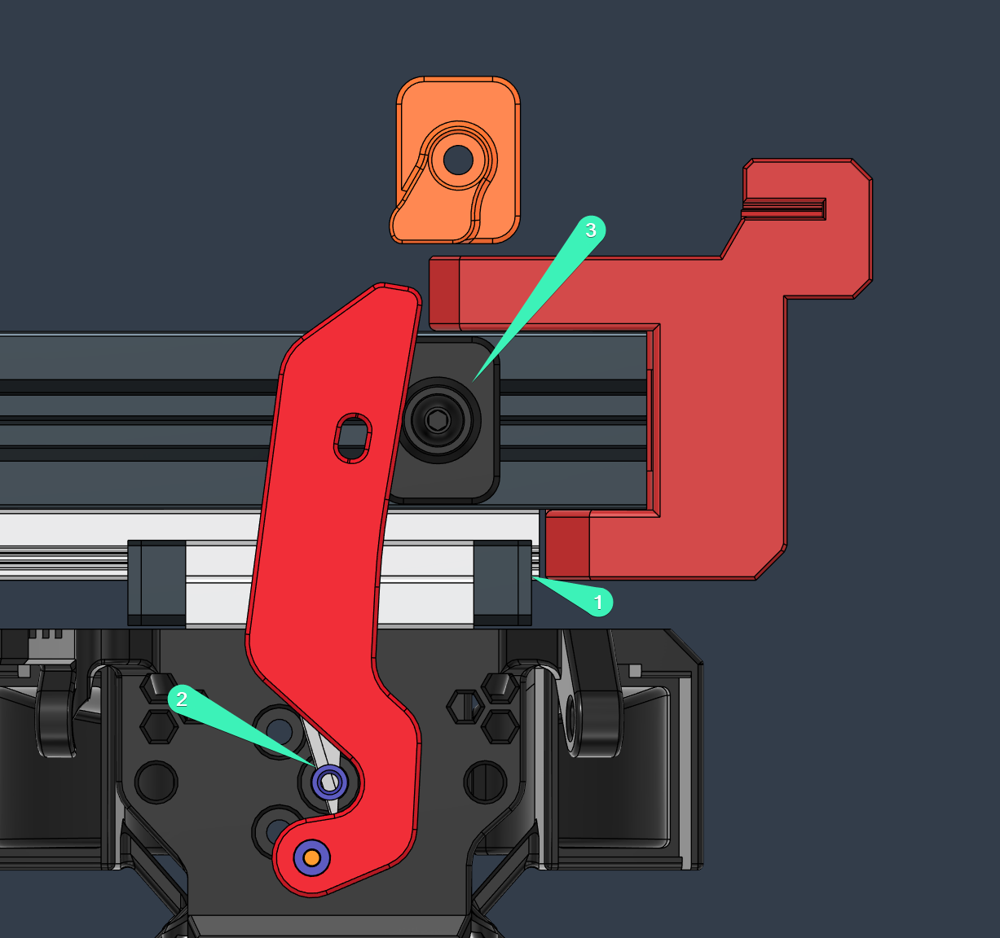

# Orbiter 2 - Sherpa Mini - Filament Cutter

A minimalistic ultra-thin, easy to install filament cutter for Orbiter 2 and Sherpa Mini extruders
*by RPi*

 

## Print

 

## BOM

Item | Quantity
-|- 
X-ACTO No. 11 Blade  | 1
Elastic Rubber Band  | 1
PTFE Tube 4mm OD 2mm ID  | 1
2mm Steel Pin, Nail / M2 Screw / Filament Pin | 1
Screw Button Head M3 12mm  | 1
2020 T-Nut M3 | 1

#### Blade Choice

 

## Assembly

* Cut the following segments of PTFE tube:
  * PTFE Bushing - 3mm
  * Bottom Tube ( LH Stinger w Dragon hotend) - ~8.5mm - chamfer at the top
  * Top Tube:
    * CNC Sherpa Mini: ~7mm - chamfer at the top
    * Orbiter 2: ~7.5mm - chamfer at the top

* Prepare a 2mm Pin measuring 5.3mm in length (can use a cut nail, screw, or a filament strand)  

* Glue the hell out of the cutter arm assembly with your choice of goo. This part is disposable when replacing.  

 

* Cut a strip of elastic band, and thread it though the arm and around a post
* Make a couple of knots with the band tensioned  
  

 

### Cutting Stopper Placement

1. Move the toolhead to the end of the travel -1mm (1)
2. With a filament strand inside the cutter pull on the cutter lever and feel the end of the cutting point (with a small overshoot) (2). 
3. Place the stopper there and mark the position (3)

*Note: Try using the **Short action stopper** (Orange) for setups that require more space for installing a [purge shute/brush](https://github.com/lhndo/LH-Stinger/tree/main/User_Mods/Other/Mini%20Purge%20Shute%20-%20%40LH)*  

 

## Pico MMU Setup Guide

**Wiki:** https://github.com/lhndo/LH-Stinger/wiki/Pico-MMU#filament-cutter
