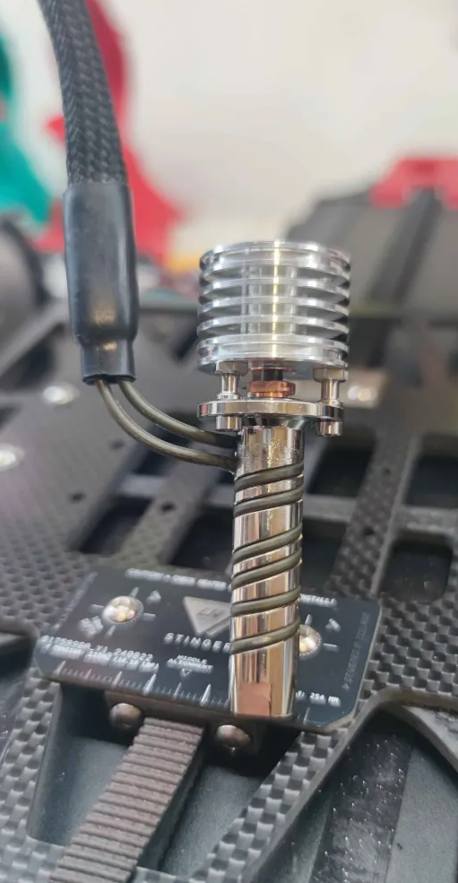
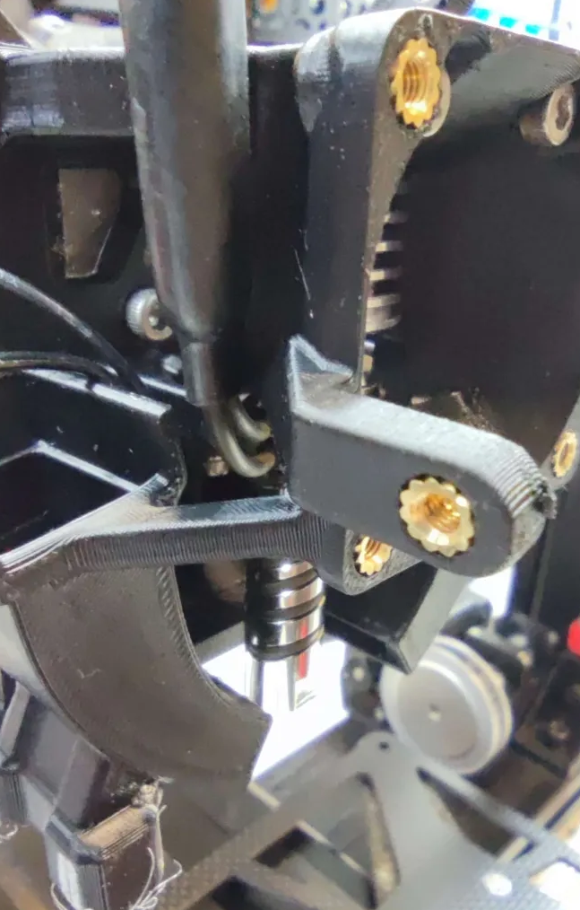

## Requires:

* [Goliath_Chube_AUX_Aero_Diverter](https://github.com/lhndo/LH-Stinger/tree/main/User_Mods/Toolhead/UHF_AUX_Aero_Diverter)
* [Z Endstop UUHF (Goliath) Hotends ](https://github.com/lhndo/LH-Stinger/tree/main/User_Mods/Printer/Z%20Endstop%20UUHF%20(Goliath)%20Hotends%20-%20%40LH)

## Installation:
*by Buff*

- Remove the heatsink and rotate it so the heater wires are at a better position. 
- Bend the heater wires. They should bend well, but be careful to not bend the same spot too often, and that the wires don't touch each other.
- Hotend itself can take some beating, but the m3 thermistor is extremely fragile so be very careful.

 

*Images by Dan329*